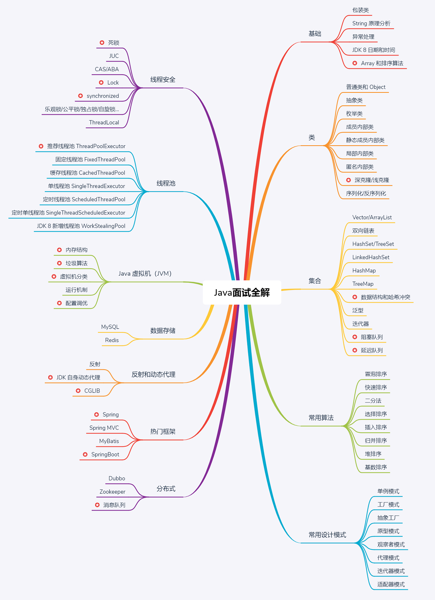
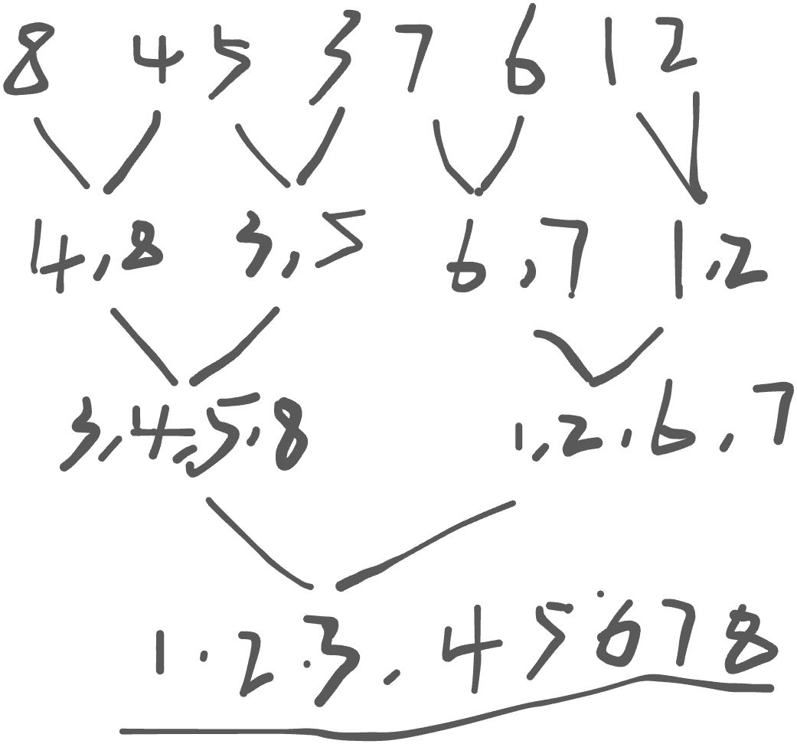

# 基础

## 包装类： 

在Java中，包装类（Wrapper Classes）是一组用于封装基本数据类型（primitive data types）的类。基本数据类型包括：byte、short、int、long、float、double、char和boolean。对应的包装类分别为：Byte、Short、Integer、Long、Float、Double、Character和Boolean。这些包装类都位于java.lang包中。<br />包装类的主要作用有以下几点：

1. 将基本数据类型转换为对象：包装类允许将基本数据类型封装成对象，以便在需要使用对象的场合，例如集合（如ArrayList、HashSet等）中，可以存储基本数据类型。
2. 提供实用方法和常量：包装类为基本数据类型提供了一些实用的方法和常量。例如，Integer类提供了parseInt方法用于将字符串解析为整数，Character类提供了isDigit方法用于检查字符是否为数字。
3. 自动装箱与自动拆箱：从Java 5开始，包装类支持自动装箱（Autoboxing）和自动拆箱（Unboxing）。自动装箱是指将基本数据类型自动转换为对应的包装类对象，而自动拆箱则是将包装类对象自动转换为对应的基本数据类型。这使得在编写代码时，可以更方便地在基本数据类型和包装类之间进行转换。<br />以下是一个关于包装类、自动装箱和自动拆箱的简单示例：

```java
public class WrapperClassExample {
    public static void main(String[] args) {
        // 自动装箱：将基本数据类型转换为包装类对象
        Integer iObj = 42; // 等价于：Integer iObj = Integer.valueOf(42);

        // 自动拆箱：将包装类对象转换为基本数据类型
        int iPrimitive = iObj; // 等价于：int iPrimitive = iObj.intValue();

        // 使用包装类提供的方法
        String binaryString = Integer.toBinaryString(iPrimitive);
        System.out.println("The binary representation of " + iPrimitive + " is: " + binaryString);
    }
}
```

总的来说，Java中的包装类用于封装基本数据类型，并提供了一些实用方法和自动装箱/拆箱的功能，以便在编写代码时能更方便地操作基本数据类型。
<a name="KShUv"></a>

## String原理解析

在Java中，String类代表一个不可变的字符序列。这意味着一旦String对象被创建，其内容就无法被改变。String类位于java.lang包中，因此我们不需要显式地导入该类。下面是对String类的一些原理进行解析：

1. 不可变性（Immutability）：String类的关键特性是其不可变性。这有助于提高安全性（例如，将字符串用作敏感信息、密码等），并降低在多线程环境中的同步开销。不可变性还有助于提高性能，因为JVM可以在字符串常量池（String Constant Pool）中共享相同内容的String对象。
2. 字符串常量池（String Constant Pool）：为了减少内存占用，JVM在内存中维护了一个特殊的存储区域，称为字符串常量池。当我们使用双引号直接创建一个字符串时，JVM首先会检查字符串常量池中是否存在相同内容的String对象。如果存在，JVM将返回该对象的引用；否则，它将在常量池中创建一个新的String对象。
3. 字符串拼接：在Java中，可以使用+运算符或StringBuilder（或StringBuffer）类来拼接字符串。由于String对象是不可变的，每次使用+运算符拼接字符串时，实际上会创建一个新的String对象，这可能导致性能问题。因此，在需要频繁拼接字符串的场景中，建议使用StringBuilder（非线程安全）或StringBuffer（线程安全）类，它们提供了更高效的字符串拼接操作。
4. String类的方法：String类提供了许多用于操作字符串的实用方法，例如length（获取字符串长度）、charAt（获取指定位置的字符）、substring（获取子字符串）、indexOf（查找字符或子字符串的位置）、equals（比较字符串内容是否相等）等。<br />下面是一个简单的示例，展示了如何使用String类的一些方法：

```java
public class StringExample {
    public static void main(String[] args) {
        // 创建字符串
        String s1 = "Hello, ";
        String s2 = "world!";

        // 字符串拼接
        String s3 = s1 + s2; // 结果为 "Hello, world!"

        // 获取字符串长度
        int length = s3.length(); // 结果为 13

        // 获取指定位置的字符
        char ch = s3.charAt(7); // 结果为 'w'

        // 获取子字符串
        String substring = s3.substring(0, 5); // 结果为 "Hello"

        // 比较字符串内容是否相等
        boolean isEqual = s1.equals(s2); // 结果为 false

        // 输出结果
        System.out.println("Concatenated string: " + s3);
        System.out.println("Length: " + length);
        System.out.println("Character at index 7: " + ch);
        System.out.println("Substring: " +
```

<a name="HcHGX"></a>

## 异常及异常处理

在Java中，异常（Exception）是程序在运行时可能遇到的问题或错误。异常处理是一种处理运行时错误的机制，使程序能够在遇到异常时仍能正常执行或优雅地终止。Java异常处理基于五个关键字：try、catch、finally、throw和throws。<br />Java异常体系主要由Throwable类及其两个子类构成：Error和Exception。Error表示系统级的错误，通常不应由程序处理。Exception表示程序级的错误，可以由程序处理。Java的异常分为两类：

1. 受检异常（Checked Exceptions）：这些异常在编译时需要处理，否则编译器将报错。受检异常通常由程序逻辑错误或外部资源问题引起，例如IOException、SQLException等。要处理这些异常，需要使用try-catch语句或通过throws关键字将异常向上抛出。
2. 非受检异常（Unchecked Exceptions）：这些异常在编译时不需要处理。非受检异常通常由编程错误引起，例如NullPointerException、ArrayIndexOutOfBoundsException、ArithmeticException等。虽然处理非受检异常不是强制的，但在可能出现异常的情况下处理它们通常是个好习惯。<br />下面是一些关于Java异常处理的基本概念：<br />● try-catch：使用try块包裹可能抛出异常的代码。如果try块中的代码抛出异常，则程序会跳转到与该异常类型匹配的catch块进行处理。可以为一个try块定义多个catch块，以处理不同类型的异常。<br />● finally：finally块是在try-catch语句后跟随的一个可选部分，其中的代码始终会被执行，无论是否发生异常。通常在finally块中进行资源的清理操作，例如关闭文件流、数据库连接等。<br />● throw：使用throw关键字可以显式抛出一个异常。这通常用于在检测到错误条件时抛出自定义异常。<br />● throws：在方法签名中使用throws关键字声明可能抛出的受检异常。这意味着调用该方法的代码需要处理这些异常，或者继续将它们向上抛出。<br />以下是一个简单的Java异常处理示例：

```java
public class ExceptionHandlingExample {
    public static void main(String[] args) {
        try {
            int result = divide(10, 0);
            System.out.println("Result: " + result);
        } catch (ArithmeticException e) {
            System.out.println("Error: Division by zero");
        } finally {
            System.out.println("This will always be executed.");
        }
    }

    public static int divide(int a, int b) throws ArithmeticException {
        if (b == 0) {
            throw new ArithmeticException("Division by zero is not allowed");
        }
        return a / b;
    }
}
```

<a name="uNxpV"></a>

## JDK8日期和时间

在JDK 8中，Java引入了一个全新的日期和时间库，该库位于java.time包中。这个新库的设计灵感来自于Joda-Time库，解决了Java早期版本中的java.util.Date和java.util.Calendar类存在的问题，提供了更加简洁、易用且线程安全的日期和时间处理功能。<br />以下是java.time包中的一些主要类：

1. LocalDate：表示不带时区的日期（年、月、日），例如：2023-04-12。
2. LocalTime：表示不带时区的时间（时、分、秒、纳秒），例如：14:30:15.123456789。
3. LocalDateTime：表示不带时区的日期和时间，结合了LocalDate和LocalTime。
4. Instant：表示时间戳，即从1970年1月1日（UTC）开始的纳秒数。它通常用于记录事件发生的精确时间。
5. ZonedDateTime：表示带时区的日期和时间。它包含了一个LocalDateTime和一个时区信息（ZoneId）。
6. Period：表示两个LocalDate之间的时间段，以年、月、日为单位。
7. Duration：表示两个时间点之间的时间间隔，以秒和纳秒为单位。
8. ZoneId：表示时区的标识符，例如：Europe/Paris、Asia/Shanghai等。
9. DateTimeFormatter：用于格式化和解析日期和时间的类。<br />下面是一个简单的示例，展示了如何使用JDK 8中的日期和时间库：

```java
package org.example;

import java.time.Duration;
import java.time.LocalDate;
import java.time.LocalDateTime;
import java.time.LocalTime;
import java.time.format.DateTimeFormatter;

public class Main {
    public static void main(String[] args) {
        // 获取当前日期
        LocalDate currentDate = LocalDate.now();
        System.out.println("Current date: " + currentDate); //2023-04-12

        // 获取当前时间
        LocalTime currentTime = LocalTime.now();
        System.out.println("Current time: " + currentTime); //15:41:54.919

        // 获取当前日期和时间
        LocalDateTime currentDateTime = LocalDateTime.now();
        System.out.println("Current date and time: " + currentDateTime);//2023-04-12T15:41:54.919

        // 格式化日期和时间
        DateTimeFormatter formatter = DateTimeFormatter.ofPattern("yyyy-MM-dd HH:mm:ss");
        String formattedDateTime = currentDateTime.format(formatter);
        System.out.println("Formatted date and time: " + formattedDateTime); //2023-04-12 15:41:54

        // 解析日期和时间
        LocalDateTime parsedDateTime = LocalDateTime.parse("2023-04-12 14:30:15", formatter);
        System.out.println("Parsed date and time: " + parsedDateTime);// 2023-04-12T14:30:15

        // 计算时间间隔
        Duration duration = Duration.between(parsedDateTime, currentDateTime);
        System.out.println("Duration in seconds: " + duration.getSeconds());//4299
    }
}
```

<a name="BeMMN"></a>

## Java数组排序 ⭐️

Java 8及之后的版本在数组处理和排序方面并没有引入新的数据结构，但它引入了一些新特性，如Lambda表达式和Stream API，可以让我们更简洁、高效地处理数组和排序操作。<br />以下是一个示例，展示如何使用Java 8的Stream API处理数组和进行排序：

```java
import java.util.Arrays;
import java.util.Comparator;
import java.util.stream.Collectors;

public class ArraySortingExample {
    public static void main(String[] args) {
        Integer[] numbers = {5, 3, 8, 1, 6, 4, 7, 2};

        // 使用Lambda表达式进行自然排序（升序）
        Integer[] sortedAscending = Arrays.stream(numbers)
                .sorted()
                .toArray(Integer[]::new);
        
        // 输出： Ascending order: [1, 2, 3, 4, 5, 6, 7, 8]
        System.out.println("Ascending order: " + Arrays.toString(sortedAscending));

        
        // 使用Lambda表达式进行降序排序
        Integer[] sortedDescending = Arrays.stream(numbers)
                .sorted(Comparator.reverseOrder())
                .toArray(Integer[]::new);
        // 输出： Descending order: [8, 7, 6, 5, 4, 3, 2, 1]
        System.out.println("Descending order: " + Arrays.toString(sortedDescending));

        // 对字符串数组进行排序
        String[] names = {"John", "Alice", "Zoe", "Bob", "Marry", "Tom"};
        String[] sortedNames = Arrays.stream(names)
                .sorted()
                .toArray(String[]::new);
        // Sorted names: [Alice, Bob, John, Marry, Tom, Zoe]
        System.out.println("Sorted names: " + Arrays.toString(sortedNames));

        // 使用自定义排序规则（如字符串长度）
        String[] sortedByLength = Arrays.stream(names)
                .sorted(Comparator.comparingInt(String::length).reversed())
                .toArray(String[]::new);
        // Sorted by length: [Alice, Marry, John, Zoe, Bob, Tom]
        System.out.println("Sorted by length: " + Arrays.toString(sortedByLength));
    }
}

```

**常见的排序算法包括：**

- 冒泡排序（Bubble Sort）
- 选择排序（Selection Sort）
- 插入排序（Insertion Sort）
- 归并排序（Merge Sort）
- 快速排序（Quick Sort）
- 堆排序（Heap Sort）

在Java中，通常可以直接使用Arrays.sort方法或Collections.sort方法进行排序，它们底层使用了TimSort算法（归并排序和插入排序的混合算法）。这些方法在大多数情况下已经足够高效，除非有特殊需求，通常不需要手动实现排序算法。

<a name="g76Ap"></a>

# 类

<a name="CLbGP"></a>

## 抽象类

在Java中，抽象类是一种特殊的类，它不能被实例化，而是用于作为其他类的父类，为它们提供一些通用的行为和特征。抽象类通过使用关键字abstract来声明，其中可以包含抽象方法和非抽象方法。抽象方法是没有实现的方法，需要由子类来实现。<br />以下是一个抽象类的示例：

```java
public abstract class Shape {
    protected int x;
    protected int y;

    public Shape(int x, int y) {
        this.x = x;
        this.y = y;
    }

    public abstract double getArea();

    public abstract double getPerimeter();

    public void move(int deltaX, int deltaY) {
        x += deltaX;
        y += deltaY;
    }
}

```

这个抽象类定义了一个形状（Shape）类，它包含了两个坐标属性x和y，以及三个方法：getArea、getPerimeter和move。其中getArea和getPerimeter是抽象方法，需要由子类来实现；move方法是非抽象方法，已经提供了默认的实现。由于Shape类是抽象类，因此不能被实例化，而是需要由子类来扩展它，并实现抽象方法。

```java
public class Rectangle extends Shape {
    private int width;
    private int height;

    public Rectangle(int x, int y, int width, int height) {
        super(x, y);
        this.width = width;
        this.height = height;
    }

    @Override
    public double getArea() {
        return width * height;
    }

    @Override
    public double getPerimeter() {
        return 2 * (width + height);
    }
}

```

这个子类扩展了Shape类，并实现了getArea和getPerimeter方法，计算矩形的面积和周长。<br />抽象类在面向对象编程中扮演了重要的角色，它可以为子类提供通用的属性和方法，并且通过强制子类实现抽象方法，可以强制实现类具有特定的行为和特征。在实际开发中，我们可以使用抽象类来定义框架、接口和基本类库。
<a name="Hw0rC"></a>

## 枚举类

在Java中，枚举类是一种特殊的类，用于表示一组固定的常量值。枚举类可以包含一个或多个枚举常量，每个枚举常量都是该类的一个实例。枚举常量通常用全大写字母表示，用逗号分隔，类似于常量的定义。<br />以下是一个枚举类的示例：

```java
public enum DayOfWeek {
    MONDAY, TUESDAY, WEDNESDAY, THURSDAY, FRIDAY, SATURDAY, SUNDAY;
}

```

这个枚举类定义了一组星期几的枚举常量。**这些常量都是DayOfWeek类的实例**，可以通过DayOfWeek.MONDAY、DayOfWeek.TUESDAY等方式来访问。<br />枚举类可以包含构造方法、成员变量和方法等。枚举类中的每个枚举常量都是该类的一个实例，因此可以给每个枚举常量指定不同的构造参数和成员变量。同时，枚举类中的方法可以为每个枚举常量提供不同的行为。<br />以下是一个扩展DayOfWeek枚举类的示例：

```java
public enum DayOfWeek {
    MONDAY("星期一", 1),
    TUESDAY("星期二", 2),
    WEDNESDAY("星期三", 3),
    THURSDAY("星期四", 4),
    FRIDAY("星期五", 5),
    SATURDAY("星期六", 6),
    SUNDAY("星期日", 7);

    private String name;
    private int value;

    private DayOfWeek(String name, int value) {
        this.name = name;
        this.value = value;
    }

    public String getName() {
        return name;
    }

    public int getValue() {
        return value;
    }

    public boolean isWeekend() {
        return this == SATURDAY || this == SUNDAY;
    }
}

```

<a name="OH8Yh"></a>

## 成员内部类

在Java中，成员内部类是定义在一个类内部的类，它可以访问外部类的所有成员变量和方法，包括私有成员。成员内部类也可以定义成员变量、成员方法和构造方法等，它们的访问修饰符可以是public、protected、默认或private。<br />以下是一个成员内部类的示例：

```java
public class OuterClass {
    private int x;

    public class InnerClass {
        public void foo() {
            x = 10; // 访问外部类的成员变量
            System.out.println("x = " + x);
        }
    }

    public void bar() {
        InnerClass inner = new InnerClass(); // 创建内部类对象
        inner.foo(); // 调用内部类的方法
    }
}

```

这个示例定义了一个OuterClass类和一个InnerClass内部类。InnerClass内部类访问了OuterClass类的成员变量x，并提供了一个foo方法来对x进行操作。OuterClass类的bar方法创建了一个InnerClass对象，并调用了它的foo方法。<br />**使用场景**<br />例如，当某个类需要使用另一个类的成员变量和方法，并且这些成员变量和方法需要保护不被其他类访问时，可以将这些成员变量和方法定义在另一个类中，成为其成员内部类。此外，成员内部类还可以访问外部类的私有成员，从而实现了封装和隐藏的效果。但是需要注意的是，成员内部类是依赖于外部类而存在的，因此在创建InnerClass对象之前，必须先创建一个OuterClass对象。
<a name="SRvan"></a>

### 缺陷：会导致内存泄漏

案例： 下面是一个使用成员内部类导致**内存泄漏的例子**：

```java
public class OuterClass {
    private List<String> data;

    public OuterClass() {
        data = new ArrayList<>();
    }

    public void add(String value) {
        data.add(value);
        // 创建一个内部类，内部类中持续持有外部类对象，导致程序无法中断，造成内存泄漏
        InnerClass inner = new InnerClass();
    }

    private class InnerClass {
        public InnerClass() {
            // 模拟内部类持续引用外部类实例的场景
            new Thread(() -> {
                while (true) {
                    try {
                        Thread.sleep(1000);
                    } catch (InterruptedException e) {
                        e.printStackTrace();
                    }
                    System.out.println(data.size());
                }
            }).start();
        }
    }
}

```

InnerClass是一个成员内部类，它持续引用了OuterClass实例中的data成员变量。在InnerClass的构造函数中，创建了一个新线程，并持续地打印data的长度，从而导致了对OuterClass实例的持续引用。因此，如果在使用OuterClass实例之后，没有手动释放InnerClass实例，就会发生内存泄漏。<br />为了避免这种内存泄漏，**可以在add方法中保存InnerClass实例的引用，并在使用完之后手动释放**，如下所示：

```java
public class OuterClass {
    private List<String> data;

    public OuterClass() {
        data = new ArrayList<>();
    }

    public void add(String value) {
        data.add(value);
        InnerClass inner = new InnerClass();
        // 使用完之后手动释放InnerClass实例
        inner.release();
    }

    private class InnerClass {
        private volatile boolean released = false;

        public InnerClass() {
            new Thread(() -> {
                // 需要通过变量控制程序，不能让无限运行下期
                while (!released) {
                    try {
                        Thread.sleep(1000);
                    } catch (InterruptedException e) {
                        e.printStackTrace();
                    }
                    System.out.println(data.size());
                }
            }).start();
        }
    	//返回true，用来终止内部类
        public void release() {
            released = true;
        }
    }
}

```

在这个修改后的例子中，InnerClass增加了一个release方法，用于释放对OuterClass实例的引用。在add方法中，使用完InnerClass实例后，调用release方法进行释放。这样就能够避免成员内部类持续引用外部类实例导致的内存泄漏问题。
<a name="klGCG"></a>

## 静态成员内部类

在Java中，静态成员内部类是定义在一个类内部，并且使用static关键字修饰的类。与非静态成员内部类不同的是，静态成员内部类不依赖于外部类的实例，因此可以直接通过外部类名来访问它的静态成员和方法，而不需要先创建一个外部类的实例。<br />以下是一个静态成员内部类的示例：

```java
public class OuterClass {
    private static int x;

    public static class InnerClass {
        public void foo() {
            x = 10; // 访问外部类的静态成员变量
            System.out.println("x = " + x);
        }
    }

    public static void bar() {
        InnerClass inner = new InnerClass(); // 创建静态内部类对象
        inner.foo(); // 调用静态内部类的方法
    }
}
```

这个示例定义了一个OuterClass类和一个InnerClass静态成员内部类。InnerClass内部类访问了OuterClass类的静态成员变量x，并提供了一个foo方法来对x进行操作。OuterClass类的bar方法创建了一个InnerClass对象，并调用了它的foo方法。<br />**与非静态成员内部类相比，静态成员内部类的使用场景更为广泛。例如，在某个类中需要定义一个辅助类，并且这个辅助类不需要访问外部类的实例变量或方法时，可以使用静态成员内部类来实现。此外，静态成员内部类还可以防止外部类的实例被持有，从而避免一些潜在的内存泄漏问题。**
<a name="xACam"></a>

## 局部内部类

在Java中，局部内部类是定义在一个方法或代码块内部的类。与成员内部类不同的是，局部内部类只能在定义它的方法或代码块中被访问，无法在外部类的其他方法中访问。<br />以下是一个局部内部类的示例：

```java
public class OuterClass {
    public void foo() {
        int x = 10;

        class InnerClass {
            public void bar() {
                System.out.println("x = " + x);
            }
        }

        InnerClass inner = new InnerClass(); // 创建局部内部类对象
        inner.bar(); // 调用局部内部类的方法
    }
}
```

这个示例定义了一个OuterClass类和一个foo方法。foo方法定义了一个局部变量x，并且在方法内部定义了一个InnerClass局部内部类。InnerClass局部内部类访问了foo方法中的x变量，并提供了一个bar方法来对x进行操作。foo方法创建了一个InnerClass对象，并调用了它的bar方法。<br />局部内部类通常用于需要访问局部变量或参数的场景。由于局部内部类只能在定义它的方法或代码块中被访问，因此它可以访问该方法或代码块中的所有变量和参数，包括final类型的变量和参数。此外，局部内部类还可以实现某些接口或继承某个类，并重写它们的方法，从而提供一些特定的功能。
<a name="NTXw8"></a>

## 匿名内部类

在Java中，匿名内部类是一种特殊的局部内部类，它没有名称，直接在创建对象的语句中定义。匿名内部类通常用于创建实现某个接口或继承某个类的对象，以提供一些特定的功能。<br />以下是一个匿名内部类的示例：

```java
public class OuterClass {
    public void foo() {
        Runnable r = new Runnable() {
            public void run() {
                System.out.println("Hello, world!");
            }
        };

        new Thread(r).start(); // 创建线程并启动
    }
}
```

这个示例定义了一个OuterClass类和一个foo方法。foo方法定义了一个Runnable类型的变量r，并使用一个匿名内部类来创建它的实例。匿名内部类实现了run方法，并在其中输出一条消息。foo方法还创建了一个新线程，并将r作为参数传递给它，从而启动了这个线程。<br />匿名内部类的语法比较特殊，它直接在创建对象的语句中定义类的实现。由于匿名内部类没有名称，因此也无法直接创建它的对象，必须借助于某个接口或抽象类来创建实例。<br />匿名内部类通常用于只需要临时使用一次的场景，例如创建某个事件监听器、回调函数等。使用匿名内部类可以减少代码量，提高可读性，并且无需为类起一个名称。
<a name="FaWcS"></a>

## 深克隆⭐️

在Java中，深克隆是一种复制对象的方式，新对象与原始对象拥有相同的属性值，但是新对象中的引用类型属性与原始对象中的引用类型属性指向不同的对象。深克隆通常需要通过递归实现，对所有引用类型属性进行深层复制。<br />以下是一个深克隆的示例：

```java
public class Person implements Cloneable {
    private String name;
    private Address address;

    public Person(String name, Address address) {
        this.name = name;
        this.address = address;
    }

    public String getName() {
        return name;
    }

    public Address getAddress() {
        return address;
    }

    @Override
    public Person clone() throws CloneNotSupportedException {
        Person clone = (Person) super.clone();
        clone.address = address.clone();
        return clone;
    }
}

public class Address implements Cloneable {
    private String city;

    public Address(String city) {
        this.city = city;
    }

    public String getCity() {
        return city;
    }

    @Override
    public Address clone() throws CloneNotSupportedException {
        return (Address) super.clone();
    }
}

public class Main {
    public static void main(String[] args) throws CloneNotSupportedException {
        // 深克隆
        Address address = new Address("Shanghai");
        Person person1 = new Person("Tom", address);
        Person person2 = person1.clone();

        // person1和person2的Address对象不同
        System.out.println(person1.getAddress() == person2.getAddress()); // false
    }
}
```

在这个示例中，Person和Address类都实现了Cloneable接口，并重写了clone方法，从而实现了深克隆。在Person的clone方法中，除了调用super.clone方法外，还对address属性进行了深层复制。在Address的clone方法中，只需要调用super.clone方法即可。<br />需要注意的是，对于引用类型属性的深层复制，需要确保该引用类型也实现了Cloneable接口并重写了clone方法，否则可能会出现克隆失败的情况。此外，深克隆可能会比较耗费时间和空间，因此需要根据实际情况选择使用浅克隆还是深克隆。
<a name="M22V0"></a>

## 浅克隆⭐️

在Java中，浅克隆是一种复制对象的方式，新对象与原始对象共享同一份数据。也就是说，新对象中的引用类型属性与原始对象中的引用类型属性指向同一个对象。浅克隆可以通过实现Cloneable接口并重写clone方法来实现。<br />以下是一个浅克隆的示例：

```java
public class Person implements Cloneable {
    private String name;
    private Address address;

    public Person(String name, Address address) {
        this.name = name;
        this.address = address;
    }

    public String getName() {
        return name;
    }

    public Address getAddress() {
        return address;
    }

    @Override
    public Person clone() throws CloneNotSupportedException {
        return (Person) super.clone();
    }
}

public class Address {
    private String city;

    public Address(String city) {
        this.city = city;
    }

    public String getCity() {
        return city;
    }
}

public class Main {
    public static void main(String[] args) throws CloneNotSupportedException {
        Address address = new Address("Shanghai");
        Person person1 = new Person("Tom", address);

        // 浅克隆
        Person person2 = person1.clone();

        // person1和person2共享同一个Address对象
        System.out.println(person1.getAddress() == person2.getAddress()); // true
    }
}
```

在这个示例中，Person类包含一个String类型的name属性和一个Address类型的address属性。Address类只包含一个String类型的city属性。Person类实现了Cloneable接口并重写了clone方法，从而实现了浅克隆。Main类中创建了一个Person对象person1和一个对person1进行浅克隆的对象person2。由于浅克隆会共享同一份数据，因此person1和person2的address属性指向同一个Address对象。<br />需要注意的是，浅克隆可能会出现对象状态共享的问题，即新对象与原始对象共享同一份数据，当新对象的属性发生变化时，原始对象的属性也会随之改变。此外，对于引用类型属性的复制，浅克隆只会复制它的引用，而不会复制它所引用的对象，**因此如果需要避免状态共享的问题，需要使用深克隆。**

<a name="raTbz"></a>

## 序列化

在Java中，序列化是将一个对象转换为字节流的过程，通常用于将对象保存到文件或在网络上传输。反序列化是将字节流转换回对象的过程。<br />Java提供了一个Serializable接口，实现该接口的类可以被序列化。当一个对象被序列化时，Java会将其所有非静态成员变量转换为字节流，并存储在一个文件或内存中。反序列化时，Java会从字节流中读取数据，并将其还原为原来的对象。<br />以下是一个序列化的示例：

```java
import java.io.*;

public class Person implements Serializable {
    private String name;
    private int age;

    public Person(String name, int age) {
        this.name = name;
        this.age = age;
    }

    public String getName() {
        return name;
    }

    public int getAge() {
        return age;
    }

    public static void main(String[] args) throws IOException, ClassNotFoundException {
        // 序列化
        Person person = new Person("Tom", 20);
        ObjectOutputStream out = new ObjectOutputStream(new FileOutputStream("person.txt"));
        out.writeObject(person);
        out.close();

        // 反序列化
        ObjectInputStream in = new ObjectInputStream(new FileInputStream("person.txt"));
        Person person2 = (Person) in.readObject();
        in.close();

        System.out.println(person2.getName()); // Tom
        System.out.println(person2.getAge()); // 20
    }
}

```

> 在这个示例中，Person类实现了Serializable接口，并定义了两个属性name和age。在main方法中，创建一个Person对象person并将其序列化到文件person.txt中。然后通过ObjectInputStream对象从文件中读取数据并反序列化为一个新的Person对象person2。

需要注意的是，被序列化的类的所有非静态成员变量都必须是可序列化的。如果被序列化的类中包含了不可序列化的成员变量，Java会抛出NotSerializableException异常。此外，序列化操作也可能会面临版本兼容性问题，即序列化的类的版本与反序列化的类的版本不兼容，可能导致反序列化失败。为了避免这种问题，可以在序列化类中定义一个版本号，用于标识类的版本，如果版本不兼容，Java会抛出InvalidClassException异常。
<a name="f3JCZ"></a>

# 集合

Java中的集合是一组相同类型的对象，可以动态地增加或删除元素。Java中提供了一些实现了不同数据结构的集合类，例如List、Set、Queue和Map等。
<a name="V3rgQ"></a>

## Vector（线程安全）

**Vector是Java中的一种动态数组，与ArrayList类似**，**但是Vector是线程安全的，支持多线程并发访问**。Vector实现了List接口，可以使用List中的所有方法，并且可以通过索引访问元素。<br />Vector是Java早期版本中的一个类，已被ArrayList取代，但由于它的线程安全性，仍然可以在某些场景下使用。Vector使用了同步机制来保证线程安全，因此在多线程环境中，多个线程访问同一个Vector对象时，会依次执行，线程之间互不干扰。<br />以下是一个使用Vector的示例：

```java
import java.util.Vector;

public class Main {
    public static void main(String[] args) {
        Vector<String> vector = new Vector<>();
        vector.add("apple");
        vector.add("banana");
        vector.add("orange");
        System.out.println(vector); // [apple, banana, orange]

        // 获取指定位置的元素
        String element = vector.get(1);
        System.out.println(element); // banana

        // 删除指定位置的元素
        vector.remove(0);
        System.out.println(vector); // [banana, orange]

        // 获取元素的个数
        int size = vector.size();
        System.out.println(size); // 2
    }
}

```

<a name="rLms8"></a>

## ArrayList（线程不安全） ⭐️

**ArrayList是Java中的一种动态数组,非线程安全的**，它可以动态地增加或删除元素，与传统的数组相比，具有更高的灵活性和便利性。ArrayList实现了List接口，可以使用List中的所有方法，并且可以通过索引访问元素。<br />ArrayList内部采用数组实现，数组的长度可以动态增加或减少。当添加元素时，如果数组已经满了，则会自动扩容。当删除元素时，如果数组的空闲空间超过一定阈值，则会自动缩容，以减少内存使用。<br />以下是一个使用ArrayList的示例：

```java
import java.util.ArrayList;

public class Main {
    public static void main(String[] args) {
        ArrayList<String> list = new ArrayList<>();
        list.add("apple");
        list.add("banana");
        list.add("orange");
        System.out.println(list); // [apple, banana, orange]

        // 获取指定位置的元素
        String element = list.get(1);
        System.out.println(element); // banana

        // 删除指定位置的元素
        list.remove(0);
        System.out.println(list); // [banana, orange]

        // 获取元素的个数
        int size = list.size();
        System.out.println(size); // 2
    }
}

```

要想使用线程安全的话：
<a name="oBVM5"></a>

## HashSet(线程不安全)、TreeSet（线程不安全）

HashSet和TreeSet都是Java中的集合类，都实现了Set接口，但它们的实现方式不同。<br />HashSet使用**哈希表实现**，可以**快速查找元素**，但是**无法保证元素的顺序**。HashSet不允许有重复元素，如果试图添加重复元素，添加操作会返回false。HashSet是一种高效的数据结构，通常用于存储需要**快速查找**的元素。<br />以下是一个使用HashSet的示例：

```java
import java.util.HashSet;
import java.util.Set;

public class Main {
    public static void main(String[] args) {
        Set<String> set = new HashSet<>();
        set.add("apple");
        set.add("banana");
        set.add("orange");
        System.out.println(set); // [banana, orange, apple]

        // 删除指定元素
        set.remove("apple");
        System.out.println(set); // [banana, orange]

        // 判断元素是否存在
        boolean contains = set.contains("banana");
        System.out.println(contains); // true

        // 获取元素的个数
        int size = set.size();
        System.out.println(size); // 2
    }
}

```

```java
 Set s = Collections.synchronizedSet(new HashSet(...))
```

TreeSet使用**树形结构**实现，可以**自动将元素按照排序规则排序**。TreeSet不允许有重复元素，如果试图添加重复元素，添加操作会返回false。TreeSet通常用于需要**排序**的场景。<br />以下是一个使用TreeSet的示例：

```java
import java.util.Set;
import java.util.TreeSet;

public class Main {
    public static void main(String[] args) {
        Set<String> set = new TreeSet<>();
        set.add("banana");
        set.add("orange");
        set.add("apple");
        System.out.println(set); // [apple, banana, orange] 是默认正序

        // 删除指定元素
        set.remove("apple");
        System.out.println(set); // [banana, orange]

        // 判断元素是否存在
        boolean contains = set.contains("banana");
        System.out.println(contains); // true

        // 获取元素的个数
        int size = set.size();
        System.out.println(size); // 2
    }
}

```

倒序的例子：

```java
import java.util.Comparator;
import java.util.Set;
import java.util.TreeSet;

public class Main {
    public static void main(String[] args) {
        Set<String> set = new TreeSet<>(new Comparator<String>() {
            @Override
            public int compare(String o1, String o2) {
                return o2.compareTo(o1); // 倒序排列
            }
        });
        set.add("apple");
        set.add("banana");
        set.add("orange");
        System.out.println(set); // [orange, banana, apple]
    }
}

```

**线程安全的例子**<br />**TreeSet 是一种非线程安全的集合**，因此如果需要在多线程环境下使用，需要使用线程安全的 TreeSet 实现类 **ConcurrentSkipListSet**。ConcurrentSkipListSet 实现了 SortedSet 接口，是一个基于跳表（SkipList）实现的线程安全有序集合，可以支持并发读写操作。以下是一个使用 ConcurrentSkipListSet 的示例代码：

```java
import java.util.concurrent.ConcurrentSkipListSet;

public class Main {
    public static void main(String[] args) {
        ConcurrentSkipListSet<Integer> set = new ConcurrentSkipListSet<>();
        set.add(3);
        set.add(1);
        set.add(4);
        set.add(2);

        for (Integer i : set) {
            System.out.println(i);
        }
    }
}
```

在上述代码中，我们首先创建了一个 ConcurrentSkipListSet 对象，并通过 add 方法向集合中添加元素。最后，我们使用 for-each 循环遍历集合中的元素，并输出每个元素的值。由于 ConcurrentSkipListSet 是线程安全的，因此可以在多线程环境下使用，而不会出现线程安全问题。
<a name="SV2kq"></a>

## LinkedHashSet（线程不安全）

LinkedHashSet是Java中的一种集合类，它是HashSet的子类，具有HashSet的所有特性，同时还保留了元素插入的顺序。LinkedHashSet通过链表来维护元素的插入顺序，因此可以保证元素的顺序与插入顺序一致。<br />与HashSet一样，LinkedHashSet也不允许有重复元素。当试图向LinkedHashSet中添加一个已经存在的元素时，添加操作会返回false，元素不会被添加。<br />以下是一个使用LinkedHashSet的示例：

```java
import java.util.LinkedHashSet;
import java.util.Set;

public class Main {
    public static void main(String[] args) {
        Set<String> set = new LinkedHashSet<>();
        set.add("banana");
        set.add("apple");
        set.add("orange");
        System.out.println(set); // [banana,apple, orange] 输出与输入一致

        // 删除指定元素
        set.remove("apple");
        System.out.println(set); // [banana, orange]

        // 判断元素是否存在
        boolean contains = set.contains("banana");
        System.out.println(contains); // true

        // 获取元素的个数
        int size = set.size();
        System.out.println(size); // 2
    }
}
```

> 在这个示例中，创建了一个LinkedHashSet对象，然后通过add方法添加元素，由于LinkedHashSet会保留元素的插入顺序，因此输出结果与添加顺序一致。其他的操作和HashSet类似。

<a name="C0R35"></a>

## HashMap（线程不安全）  ⭐️

HashMap是Java中的一种映射表（Map）结构，可以将键映射到值上。HashMap通过哈希表来实现，它可以动态地增加或删除元素，同时可以通过键快速查找元素。<br />在Java 1.7中，HashMap内部是由一个数组和链表组成的。数组中的每个元素称为桶（bucket），每个桶中存储了一个链表。当添加一个新元素时，首先会根据元素的哈希值确定元素应该被放到哪个桶中，然后将该元素添加到对应的链表中。当需要查找元素时，首先根据键的哈希值找到对应的桶，然后遍历该桶中的链表，查找对应的键值对。<br />在Java 1.8中，HashMap内部结构有了一些改进，主要包括以下两点：

1. 当链表中的元素数量超过一定阈值时，会将链表转换为红黑树。红黑树可以提高查找效率，并且可以保证查找时间的上限为O(log n)，从而避免链表退化为线性查找的情况。
2. 当HashMap中的元素数量超过一定阈值时，会自动进行扩容。扩容会创建一个新的数组，并将原数组中的元素重新分配到新数组中。这个过程中需要进行哈希计算和元素复制，因此会消耗一定的时间和空间。扩容的阈值由负载因子（load factor）控制，默认值为0.75，表示在HashMap中存储的元素数量超过容量的75%时会触发扩容。
3. 需要注意的是，**在多线程环境下，HashMap是不安全的，**需要使用线程安全的集合类或者对HashMap进行同步处理。<br />以下是一个使用HashMap的示例：

```java
import java.util.HashMap;
import java.util.Map;

public class Main {
    public static void main(String[] args) {
        Map<String, Integer> map = new HashMap<>();
        map.put("apple", 1);
        map.put("banana", 2);
        map.put("orange", 3);
        System.out.println(map); // {orange=3, apple=1, banana=2}

        // 删除指定键值对
        map.remove("apple");
        System.out.println(map); // {orange=3, banana=2}

        // 获取指定键的值
        int value = map.get("banana");
        System.out.println(value); // 2

        // 判断指定键是否存在
        boolean contains = map.containsKey("orange");
        System.out.println(contains); // true

        // 获取键值对的个数
        int size = map.size();
        System.out.println(size); // 2
    }
}
```

> 在这个示例中，创建了一个HashMap对象，然后通过put方法添加键值对，使用remove方法删除指定键值对，使用get方法获取指定键的值，使用containsKey方法判断指定键是否存在，使用size方法获取键值对的个数。

<a name="jrwal"></a>

## TreeMap（线程不安全，有序）

TreeMap是Java中的一种映射表（Map）结构，可以将键映射到值上。TreeMap通过红黑树来实现，它可以动态地增加或删除元素，同时可以通过键快速查找元素。**TreeMap与HashMap相比，它可以保证元素的有序性，即按照键的自然顺序或者自定义的比较器进行排序。**<br />在Java中，TreeMap内部的红黑树结构可以保证插入、查找、删除等操作的时间复杂度为O(log n)，因此性能较为稳定。与HashMap相比，TreeMap在插入和删除元素时需要进行红黑树的平衡操作，因此性能略逊于HashMap，但是它可以提供有序的遍历功能，适用于需要有序遍历的场景。<br />需要注意的是，**在多线程环境下，TreeMap是不安全的，**需要使用线程安全的集合类或者对TreeMap进行同步处理。<br />以下是一个使用TreeMap的示例：

```java
import java.util.Map;
import java.util.TreeMap;

public class Main {
    public static void main(String[] args) {
        Map<String, Integer> map = new TreeMap<>();
        map.put("apple", 1);
        map.put("banana", 2);
        map.put("orange", 3);
        System.out.println(map); // {apple=1, banana=2, orange=3}

        // 删除指定键值对
        map.remove("apple");
        System.out.println(map); // {banana=2, orange=3}

        // 获取指定键的值
        int value = map.get("banana");
        System.out.println(value); // 2

        // 判断指定键是否存在
        boolean contains = map.containsKey("orange");
        System.out.println(contains); // true

        // 获取键值对的个数
        int size = map.size();
        System.out.println(size); // 2
    }
}
```

> 在这个示例中，创建了一个TreeMap对象，然后通过put方法添加键值对，使用remove方法删除指定键值对，使用get方法获取指定键的值，使用containsKey方法判断指定键是否存在，使用size方法获取键值对的个数。**由于TreeMap会根据键的自然顺序或者自定义的比较器进行排序，因此输出结果是有序的。**

<a name="iAxy7"></a>

## Hash table

Hash表（Hash table），也称为散列表，是一种**基于Hash算法**实现的数据结构，可以用于**快速存储和查找数据**。Hash表的特点是将数据元素的关键字通过Hash函数映射到一定范围内的整数值（也称为哈希值），然后将这些值作为数据元素的索引存储到一个数组中。<br />在Java中，**HashMap和HashSet就是基于Hash table实现的**。当向HashMap或HashSet中添加元素时，首先会根据元素的哈希值计算出元素应该存储在数组中的位置，然后将元素存储到该位置上。当需要查找元素时，同样会根据元素的哈希值找到对应的数组位置，然后在该位置上查找元素。<br />Hash表的优点是可以提供O(1)的时间复杂度进行数据存储和查找操作。但是在数据元素的哈希值相同时，不同的元素可能会被存储在同一个数组位置上，这就产生了哈希冲突。为了解决哈希冲突，Hash表一般采用链表或者红黑树等数据结构来存储相同哈希值的元素，从而保证数据元素的正确性和效率。<br />需要注意的是，在**多线程环境下，Hash表是不安全的**，需要使用线程安全的集合类或者对Hash表进行同步处理。
<a name="A9nXF"></a>

## 数据结构及哈希冲突 ⭐️

数据结构是指组织和管理数据的方式，包括各种数据类型、数据关系和操作等。常见的数据结构有**数组、链表、树、图等。**<br />哈希冲突是指在Hash表中，不同的数据元素计算出的哈希值相同的情况。当发生哈希冲突时，不同的数据元素可能会被存储在同一个数组位置上，从而导致数据元素的丢失或者错误。<br />为了解决哈希冲突，Hash表一般采用链表或者红黑树等数据结构来存储相同哈希值的元素。在Java中，HashMap和HashSet都采用了这种方法来处理哈希冲突。当哈希表中存在多个数据元素哈希值相同的情况时，这些数据元素会被存储在同一个数组位置上，并组成一个链表或者红黑树。当需要查找元素时，首先会根据元素的哈希值找到对应的数组位置，然后在该位置上遍历链表或者红黑树，查找对应的元素。<br />**为了避免哈希冲突的发生，我们可以采取以下措施：**

1. 选择合适的哈希函数：哈希函数的好坏决定了哈希表的质量。一个好的哈希函数应该具有均匀性、散列性和高效性等特点，能够使得哈希值分布均匀，尽量避免冲突的发生。
2. 调整哈希表的容量：当哈希表中元素的数量过多时，容易发生哈希冲突。为了避免这种情况，可以调整哈希表的容量，让哈希表能够容纳更多的元素。在Java中，HashMap和HashSet的容量可以通过构造函数或者resize方法进行调整。
3. 链表和红黑树的性能优化：当哈希表中存在大量相同哈希值的元素时，链表或红黑树的性能可能会受到影响。为了提高性能，可以采取一些优化措施，例如在链表中使用尾插法、使用红黑树进行元素存储等。
   <a name="qiGaP"></a>

## 泛型

泛型是Java语言中的一个特性，可以实现代码的类型安全和代码重用。它可以让我们在编译时就能发现类型错误，而不是在运行时才抛出异常。泛型还可以让我们编写更加通用的代码，减少代码的重复和冗余。<br />在Java中，泛型可以应用于类、接口、方法等。通过使用泛型，我们可以定义一个可以操作不同类型的对象的类、接口或方法。在泛型中，使用一个占位符来代表类型参数，比如使用“T”表示泛型类型。<br />泛型的优点主要包括以下几点：

1. 类型安全：使用泛型可以让我们在编译时就能发现类型错误，从而减少程序运行时出现异常的可能性。
2. 代码重用：使用泛型可以让我们编写更加通用的代码，可以在不同的场景中重复使用。
3. 程序性能：使用泛型可以避免进行类型转换，从而提高程序的性能。

泛型的应用非常广泛，包括集合框架、网络编程、反射、注解等。在集合框架中，泛型可以让我们定义不同类型的集合对象，比如ArrayList、HashMap<Integer, String>等，从而提高了代码的可读性和可维护性。在网络编程中，泛型可以用于定义网络数据包的类型，从而方便地对数据包进行解析和处理。在反射中，泛型可以用于获取和操作类的信息，比如获取泛型类型、调用泛型方法等。在注解中，泛型可以用于定义注解的属性类型，从而使注解更加通用。<br />以下是一些常用的泛型使用场景及对应的代码示例：

1. 集合类中的泛型：

```java
List<String> list = new ArrayList<>();
list.add("Hello");
list.add("World");
for (String s : list) {
    System.out.println(s);
}
```

2. 泛型方法：

```java
public static <T> void printArray(T[] array) {
    for (T element : array) {
        System.out.println(element);
    }
}

Integer[] intArray = { 1, 2, 3, 4, 5 };
String[] stringArray = { "Hello", "World" };
printArray(intArray);
printArray(stringArray);
```

> 在上面的代码中，定义了一个泛型方法printArray，该方法可以接收任意类型的数组，并将数组中的元素打印出来。在方法定义中使用了类型参数T，表示该方法可以操作任意类型的数组。

3. 自定义泛型类：

```java
public class Box<T> {
    private T data;

    public Box(T data) {
        this.data = data;
    }

    public T getData() {
        return data;
    }

    public void setData(T data) {
        this.data = data;
    }
}

Box<String> box = new Box<>("Hello World");
System.out.println(box.getData());
```

> 在上面的代码中，定义了一个泛型类Box，该类可以包含任意类型的数据，并提供了相应的方法进行操作。在类定义中使用了类型参数T，表示该类可以包含任意类型的数据。在创建对象时，指定了Box的泛型类型为String，表示该Box对象只能包含String类型的数据。

这些示例只是泛型的应用场景之一，实际上泛型还可以应用于很多其他的场景中。通过使用泛型，可以提高代码的可读性和可维护性，减少类型转换和类型错误，从而使代码更加健壮和高效。
<a name="zPfAu"></a>

## 迭代器⭐️

迭代器（Iterator）是Java集合框架中的一个接口，用于**遍历集合中的元素**。通过迭代器，我们可以按照一定的顺序依次访问集合中的每个元素，并进行相应的操作。迭代器提供了一种统一的方式来访问不同类型的集合对象，使得集合框架更加灵活和易用。<br />在Java中，迭代器通过Iterator接口进行定义，该接口中包含了以下几个方法：

1. hasNext()：判断集合中是否还有下一个元素。
2. next()：返回集合中的下一个元素。
3. remove()：从集合中移除最近返回的元素。

使用迭代器遍历集合对象的代码如下：

```java
List<String> list = new ArrayList<>();
list.add("Hello");
list.add("World");
Iterator<String> it = list.iterator();
while (it.hasNext()) {
    String s = it.next();
    System.out.println(s);
}

```

**优点：**<br />是可以让我们在遍历集合对象时，不需要了解集合的具体实现，只需要通过迭代器提供的方法即可访问集合中的元素。同时，迭代器还可以支持在遍历集合时进行元素的删除操作，从而提高了集合的灵活性。<br />需要注意的是，**在多线程环境下，使用迭代器可能会产生线程安全问题**，需要进行适当的同步处理或者使用线程安全的集合类。
<a name="keRMN"></a>

## [线程安全的集合⭐️](#OHoCk)

Java中提供了许多线程安全的集合类，它们可以在多线程环境中安全地使用，避免了线程安全问题。下面是常用的线程安全的集合类：

> 1. ConcurrentHashMap：线程安全的HashMap实现，适用于高并发的情况。
> 2. CopyOnWriteArrayList：线程安全的List实现，适用于读多写少的场景。它的特点是在写操作时，会复制一个新的数组，对该数组进行修改，从而避免了读写之间的冲突。
> 3. CopyOnWriteArraySet：线程安全的Set实现，内部使用CopyOnWriteArrayList实现，具有和CopyOnWriteArrayList类似的特点。
> 4. ConcurrentLinkedQueue：线程安全的队列实现，适用于高并发的情况。它的特点是基于链表实现，支持高效的并发访问。
> 5. LinkedBlockingQueue：线程安全的阻塞队列实现，适用于生产者-消费者模型。
> 6. ConcurrentSkipListMap：线程安全的有序Map实现，适用于高并发的情况。

除了上述集合类，Java还提供了一些线程安全的工具类，比如CountDownLatch、Semaphore、CyclicBarrier等，这些类可以帮助我们更好地实现线程安全的操作。需要根据具体的业务场景选择合适的线程安全集合类或工具类。
<a name="ExqaG"></a>

### ConcurrentHashMap是如何保证线程安全的

ConcurrentHashMap是Java中并发编程中常用的线程安全容器，它在实现线程安全的过程中，采用了多种优化手段。

> 1. 分段锁设计<br />ConcurrentHashMap内部采用了分段锁的设计，将整个map分成了一系列的段（Segment），每个段都是一个独立的哈希表，每个段都只被一把锁所保护。这样就可以将多个线程的访问并发化，只需要锁定同一段中的数据，而不需要锁定整个map。
> 2. CAS操作<br />ConcurrentHashMap使用了CAS操作（Compare And Swap），在添加或者删除元素时，先比较key的hash值，如果相同再使用CAS操作尝试加入或删除元素。这样就可以在多线程环境下保证元素的一致性，同时避免了不必要的锁竞争。
> 3. volatile修饰<br />ConcurrentHashMap内部使用了volatile修饰的成员变量，保证了多线程之间的可见性。
> 4. 锁分离技术<br />ConcurrentHashMap内部采用了锁分离技术，将读写操作分离到不同的锁上，读操作不需要锁定，提高了并发读取的性能。<br />综上所述，ConcurrentHashMap通过分段锁设计、CAS操作、volatile修饰和锁分离技术等多种优化手段，实现了高效的线程安全。在多线程环境中，使用ConcurrentHashMap能够有效地提高程序的并发性能。

<a name="Wnf8n"></a>

## 阻塞队列 ⭐️

阻塞队列（Blocking Queue）是Java中的一个**并发集合**类，它支持在队列为空或队列已满时阻塞线程的操作。阻塞队列在多线程编程中非常有用，可以很好地解决生产者-消费者模型的问题。<br />阻塞队列的**特点**是，**当队列已满时，生产者线程会被阻塞，直到队列中有空闲位置；当队列为空时，消费者线程会被阻塞，直到队列中有新的元素**。这样就可以很好地控制生产者和消费者之间的速度，从而避免了生产者过快或消费者过慢导致的问题。<br />Java中提供了多种阻塞队列的实现，包括：

1. ArrayBlockingQueue：基于数组实现的有界阻塞队列。
2. LinkedBlockingQueue：基于链表实现的可选有界阻塞队列。
3. PriorityBlockingQueue：基于优先级堆实现的无界阻塞队列。
4. SynchronousQueue：没有容量的阻塞队列，每个插入操作必须等待相应的删除操作，反之亦然。<br />阻塞队列的应用场景非常广泛，比如生产者-消费者模型、线程池、事件驱动等。在使用阻塞队列时，需要注意选择合适的队列实现，根据业务场景合理配置队列的大小和阻塞策略，以保证程序的正确性和性能。同时，在生产者和消费者的代码中，需要正确地处理阻塞异常和中断异常，以避免线程阻塞或意外退出。

**生产者-消费者模型示例**<br />以下是一个简单的使用阻塞队列的生产者-消费者模型示例，其中使用了Java中的LinkedBlockingQueue实现阻塞队列：

```java
import java.util.concurrent.BlockingQueue;
import java.util.concurrent.LinkedBlockingQueue;

public class BlockingQueueExample {
    private static final int QUEUE_SIZE = 10;
    private static final int PRODUCER_COUNT = 5;
    private static final int CONSUMER_COUNT = 3;

    public static void main(String[] args) {
        // 创建阻塞队列
        BlockingQueue<Integer> queue = new LinkedBlockingQueue<>(QUEUE_SIZE);

        // 创建生产者线程
        for (int i = 1; i <= PRODUCER_COUNT; i++) {
            Thread producerThread = new Thread(() -> {
                try {
                    int value = 0;
                    while (true) {
                        // 生产元素并将其放入队列
                        queue.put(value);
                        System.out.println("Producer " + Thread.currentThread().getId() + " produced " + value);
                        value++;
                    }
                } catch (InterruptedException e) {
                    e.printStackTrace();
                }
            });
            producerThread.start();
        }

        // 创建消费者线程
        for (int i = 1; i <= CONSUMER_COUNT; i++) {
            Thread consumerThread = new Thread(() -> {
                try {
                    while (true) {
                        // 从队列中取出元素并进行消费
                        int value = queue.take();
                        System.out.println("Consumer " + Thread.currentThread().getId() + " consumed " + value);
                    }
                } catch (InterruptedException e) {
                    e.printStackTrace();
                }
            });
            consumerThread.start();
        }
    }
}
//这个程序没有终止的地方，会无线执行下去。
```

> 在上面的代码中，首先创建了一个大小为10的阻塞队列，然后创建了5个生产者线程和3个消费者线程，分别向队列中生产元素和从队列中消费元素。在生产者线程中，使用了LinkedBlockingQueue的put方法将生产的元素放入队列中，如果队列已满，则该方法会阻塞线程；在消费者线程中，使用了LinkedBlockingQueue的take方法从队列中取出元素进行消费，如果队列为空，则该方法会阻塞线程。这样就实现了一个简单的阻塞队列的生产者-消费者模型。

<a name="uNhAA"></a>

## 延迟队列⭐️

延迟队列（Delay Queue）是Java中的一个并发集合类，它可以实现在指定时间后获取元素的功能。延迟队列在一些场景下非常有用，比如**定时任务调度、缓存过期清理**等。<br />**延迟队列的元素需要实现Delayed接口**，该接口包含两个方法：

1. long getDelay(TimeUnit unit)：返回元素剩余的延迟时间，以给定的时间单位表示。
2. int compareTo(Delayed other)：比较元素的延迟时间，如果当前元素的延迟时间小于other元素的延迟时间，则返回负整数，如果当前元素的延迟时间大于other元素的延迟时间，则返回正整数，如果相等则返回0。

Java中提供了一个基于PriorityQueue实现的DelayQueue，它支持按照元素的延迟时间进行排序，可以方便获取延迟时间最短的元素。<br />下面是一个简单的使用延迟队列的示例：

```java
import java.util.concurrent.DelayQueue;
import java.util.concurrent.Delayed;
import java.util.concurrent.TimeUnit;

public class DelayQueueExample {
    public static void main(String[] args) throws InterruptedException {
        // 创建延迟队列
        DelayQueue<DelayedElement> queue = new DelayQueue<>();

        // 添加元素到队列中
        queue.put(new DelayedElement("Task 1", 5, TimeUnit.SECONDS));
        queue.put(new DelayedElement("Task 2", 10, TimeUnit.SECONDS));
        queue.put(new DelayedElement("Task 3", 15, TimeUnit.SECONDS));

        // 从队列中取出元素进行处理
        while (!queue.isEmpty()) {
            //按照元素的过期时间排序，并取出延迟时间最短的元素进行处理
            DelayedElement element = queue.take();
            System.out.println("Process " + element.getName() + " at " + System.currentTimeMillis());
        }
    }
}

// 实现Delayed接口的元素类
class DelayedElement implements Delayed {
    private String name;
    private long delay;
    private long expire;

    public DelayedElement(String name, long delay, TimeUnit unit) {
        this.name = name;
        this.delay = TimeUnit.MILLISECONDS.convert(delay, unit);
        this.expire = System.currentTimeMillis() + this.delay;
    }

    public String getName() {
        return name;
    }

    @Override
    public long getDelay(TimeUnit unit) {
        return unit.convert(expire - System.currentTimeMillis(), TimeUnit.MILLISECONDS);
    }

    @Override
    public int compareTo(Delayed o) {
        return Long.compare(this.expire, ((DelayedElement) o).expire);
    }
}

```

> 在上面的代码中，首先创建了一个DelayQueue，并向其中添加了三个元素，分别表示需要延迟5秒、10秒和15秒执行的任务。在每个元素的构造函数中，通过TimeUnit将延迟时间转换为毫秒，并计算出该元素的过期时间。在DelayQueue的take方法中，会自动按照元素的过期时间排序，并取出延迟时间最短的元素进行处理。这样就实现了一个简单的延迟队列的示例。

<a name="d7ht8"></a>

# 常用算法

<a name="MvnJ2"></a>

## 冒泡排序

冒泡排序（Bubble Sort）是一种简单的排序算法，它的基本思想是从未排序的数据中找出最大（或最小）的元素，然后将其放到已排序的数据的末尾（或开头），然后继续从未排序的数据中找出最大（或最小）的元素，以此类推，直到所有数据都已排序完成。<br />冒泡排序的时间**复杂度为O(n^2)**，其中n为待排序数据的数量，因此**对于大量数据的排序时，不适合使用冒泡排序**。<br />下面是一个简单的冒泡排序的实现示例

```java
public class BubbleSortExample {
    public static void bubbleSort(int[] arr) {
        if (arr == null || arr.length < 2) {
            return;
        }
        for (int i = 0; i < arr.length - 1; i++) {
            for (int j = 0; j < arr.length - 1 - i; j++) {
                if (arr[j] > arr[j + 1]) {
                    int temp = arr[j];
                    arr[j] = arr[j + 1];
                    arr[j + 1] = temp;
                }
            }
        }
    }

    public static void main(String[] args) {
        int[] arr = {3, 5, 1, 4, 2};
        bubbleSort(arr);
        System.out.println(Arrays.toString(arr)); // [1, 2, 3, 4, 5]
    }
}

```

> 在上面的代码中，首先定义了一个bubbleSort方法，该方法接受一个整型数组作为参数，实现冒泡排序的功能。在方法中，使用了两层循环，第一层循环控制排序的趟数，第二层循环控制每趟排序中元素的比较和交换。在每趟排序中，如果相邻两个元素的大小关系不正确，则交换它们的位置，直到本趟排序结束。最终，整个数组就完成了排序。在main方法中，我们可以测试该排序算法的正确性。

<a name="K9sfP"></a>

## 快速排序

快速排序（Quick Sort）是一种常用的排序算法，它的**基本思想**是通过一次排序将待排序数据分割成独立的两部分，其中一部分的所有元素都比另一部分的所有元素小，然后再分别对这两部分进行排序，以此类推，直到所有数据都已排序完成。<br />快速排序的时间**复杂度为O(nlogn)**，其中n为待排序数据的数量，它是一种比较高效的排序算法。下面是一个简单的快速排序的实现示例：

```java
public class QuickSortExample {

    /**
     * 快速排序算法实现
     *
     * @param arr   待排序的数组
     * @param left  数组左边界
     * @param right 数组右边界
     */
    public static void quickSort(int[] arr, int left, int right) {
        // 递归终止条件，当左右指针相遇或者左指针大于右指针时，返回
        if (left >= right) {
            return;
        }
        // 对数组进行分区，得到基准点位置
        int pivot = partition(arr, left, right);
        // 分治处理左半部分
        quickSort(arr, left, pivot - 1);
        // 分治处理右半部分
        quickSort(arr, pivot + 1, right);
    }

    /**
     * 对数组进行分区
     *
     * @param arr   待分区的数组
     * @param left  数组左边界
     * @param right 数组右边界
     * @return 返回基准点的位置
     */
    public static int partition(int[] arr, int left, int right) {
        // 选择数组左边第一个元素作为基准点
        int pivot = arr[left];
        while (left < right) {
            // 从右边开始找到第一个小于基准点的元素
            while (left < right && arr[right] >= pivot) {
                right--;
            }
            // 将找到的小于基准点的元素移动到左边
            arr[left] = arr[right];
            // 从左边开始找到第一个大于基准点的元素
            while (left < right && arr[left] <= pivot) {
                left++;
            }
            // 将找到的大于基准点的元素移动到右边
            arr[right] = arr[left];
        }
        // 将基准点放到数组的正确位置上
        arr[left] = pivot;
        // 返回基准点的位置
        return left;
    }

    public static void main(String[] args) {
        int[] arr = {3, 5, 1, 4, 2};
        // 对数组进行快速排序
        quickSort(arr, 0, arr.length - 1);
        // 输出排序后的数组
        System.out.println(Arrays.toString(arr)); // [1, 2, 3, 4, 5]
    }
}

```

> 在上面的代码中，首先定义了一个quickSort方法，该方法接受一个整型数组和左右两个指针作为参数，实现快速排序的功能。在方法中，使用了递归的方式对数组进行排序，每次选择一个基准元素，将数组中小于该元素的元素放在其左侧，将大于该元素的元素放在其右侧，并返回该基准元素的位置。然后，再对基准元素的左侧和右侧两个部分进行递归排序，直到所有数据都已排序完成。在partition方法中，使用了左右指针的方式对数组进行划分，直到左右指针相遇。最终，整个数组就完成了排序。在main方法中，我们可以测试该排序算法的正确性。

<a name="tBBQr"></a>

## 二分法

二分法（Binary Search），也称折半搜索，是一种常用的查找算法，它的**基本思想**是将有序数组不断地分成两半，直到找到目标元素为止。<br />二分法的**时间复杂度为O(log n)**，其中n为数组的长度，它是一种**比较高效的查找算法**。下面是一个简单的二分法的实现示例：

```java
public class BinarySearchExample {
    // 二分查找函数，接收一个有序数组和一个目标值
    public static int binarySearch(int[] arr, int target) {
        // 特判：如果数组为空，则返回 -1
        if (arr == null || arr.length == 0) {
            return -1;
        }
        // 初始化左右指针
        int left = 0;
        int right = arr.length - 1;
        // 当左指针小于等于右指针时，进行循环查找
        while (left <= right) {
            // 计算中间值的下标
            int mid = (left + right) / 2;
            // 如果中间值等于目标值，直接返回下标
            if (arr[mid] == target) {
                return mid;
            // 如果中间值小于目标值，则目标值在右半部分，将左指针移动到中间值的右边一位
            } else if (arr[mid] < target) {
                left = mid + 1;
            // 如果中间值大于目标值，则目标值在左半部分，将右指针移动到中间值的左边一位
            } else {
                right = mid - 1;
            }
        }
        // 如果循环结束仍未找到目标值，返回 -1
        return -1;
    }

    public static void main(String[] args) {
        int[] arr = {1, 2, 3, 4, 5};
        int target = 3;
        int index = binarySearch(arr, target);
        System.out.println(index); // 2
    }
}

```

> 在上面的代码中，定义了一个binarySearch方法，该方法接受一个有序整型数组和目标元素作为参数，实现二分查找的功能。在方法中，使用了左右指针和中间指针的方式进行二分查找，每次将数组不断地分成两半，直到找到目标元素为止。在main方法中，我们可以测试该查找算法的正确性。

<a name="GCYOy"></a>

## 选择排序

选择排序（Selection Sort）是一种简单的排序算法，它的**基本思想**是在待排序数据中选择最小（或最大）的元素，将其放到已排序的数据的末尾（或开头），然后继续从未排序的数据中选择最小（或最大）的元素，以此类推，直到所有数据都已排序完成。<br />选择排序的时间**复杂度为O(n^2)**，其中n为待排序数据的数量，因此**对于大量数据的排序时，不适合使用选择排序**。下面是一个简单的选择排序的实现示例：

```java
package org.example;

import java.util.Arrays;

/**
 * 选择排序示例
 */
public class SelectionSortExample {

    /**
     * 选择排序算法
     *
     * @param arr 待排序数组
     */
    public static void selectionSort(int[] arr) {
        // 如果数组为null或长度小于2，不需要排序
        if (arr == null || arr.length < 2) {
            return;
        }
        // 外层循环控制每次选择的起始位置，从0开始到length-1
        for (int i = 0; i < arr.length - 1; i++) {
            int minIndex = i; // 假设当前位置的元素是最小的
            // 内层循环找到当前位置之后最小的元素
            for (int j = i + 1; j < arr.length; j++) {
                if (arr[j] < arr[minIndex]) {
                    minIndex = j; // 更新最小元素的下标
                }
            }
            // 如果当前位置不是最小元素的位置，则交换当前位置和最小位置的元素
            if (minIndex != i) {
                int temp = arr[i];
                arr[i] = arr[minIndex];
                arr[minIndex] = temp;
            }
        }
    }

    public static void main(String[] args) {
        int[] arr = {3, 5, 1, 4, 2};
        selectionSort(arr);
        System.out.println(Arrays.toString(arr)); // [1, 2, 3, 4, 5]
    }
}
```

> 在上面的代码中，首先定义了一个selectionSort方法，该方法接受一个整型数组作为参数，实现选择排序的功能。在方法中，使用了两层循环，第一层循环控制排序的趟数，第二层循环控制每趟排序中找到最小元素的位置，然后将该元素和本趟排序的第一个元素进行交换。最终，整个数组就完成了排序。在main方法中，我们可以测试该排序算法的正确性。

<a name="Ox3t9"></a>

## 插入排序

插入排序（Insertion Sort）是一种简单的排序算法，它的**基本思想**是将待排序数据分成两部分，已排序和未排序，每次将未排序的数据插入到已排序的数据中的正确位置，直到所有数据都已排序完成。<br />插入排序的时间复杂度为O(n^2)，其中n为待排序数据的数量，因此对于大量数据的排序时，不适合使用插入排序。下面是一个简单的插入排序的实现示例：

```java
/**
 * 插入排序算法
 *
 * @param arr 待排序的数组
 */
public static void insertionSort(int[] arr) {
    if (arr == null || arr.length < 2) {
        return;
    }
    // 从数组第二个元素开始，将元素插入到前面已排序序列中的合适位置
    for (int i = 1; i < arr.length; i++) {
        int j = i;
        // 将元素与已排序序列中的元素从后往前依次比较，找到合适的位置插入
        while (j > 0 && arr[j] < arr[j - 1]) {
            int temp = arr[j];
            arr[j] = arr[j - 1];
            arr[j - 1] = temp;
            j--;
        }
    }
}

public static void main(String[] args) {
    int[] arr = {3, 5, 1, 4, 2};
    insertionSort(arr);
    System.out.println(Arrays.toString(arr)); // [1, 2, 3, 4, 5]
}

```

> 在上面的代码中，首先定义了一个insertionSort方法，该方法接受一个整型数组作为参数，实现插入排序的功能。在方法中，使用了两层循环，第一层循环控制每次待排序的元素，第二层循环控制将该元素插入到已排序的数据中的正确位置。最终，整个数组就完成了排序。在main方法中，我们可以测试该排序算法的正确性。

<a name="Y8o5t"></a>

## 归并排序

归并排序（Merge Sort）是一种**分治思想的排序算法**，它的基本思想是将待排序数据分成两个部分，分别进行排序，然后将排序后的两个部分合并成一个有序序列。<br />归并排序的时间复杂度为O(n log n)，其中n为待排序数据的数量，它是一种**比较高效的排序算法**。下面是一个简单的归并排序的实现示例：

```java
public class MergeSortExample {
    // 归并排序主方法
    public static void mergeSort(int[] arr) {
        // 如果数组为空或只有一个元素，不需要排序
        if (arr == null || arr.length < 2) {
            return;
        }
        mergeSort(arr, 0, arr.length - 1);
    }

    // 使用递归进行归并排序
    private static void mergeSort(int[] arr, int left, int right) {
        // 当左边界大于等于右边界时，说明已经完成排序
        if (left >= right) {
            return;
        }
        int mid = (left + right) / 2;
        mergeSort(arr, left, mid);
        mergeSort(arr, mid + 1, right);
        merge(arr, left, mid, right);
    }

    // 合并两个有序数组
    private static void merge(int[] arr, int left, int mid, int right) {
        int[] temp = new int[right - left + 1]; // 创建一个临时数组用于存放合并结果
        int i = left;
        int j = mid + 1;
        int k = 0;

        // 将较小的元素依次放入临时数组
        while (i <= mid && j <= right) {
            if (arr[i] < arr[j]) {
                temp[k++] = arr[i++];
            } else {
                temp[k++] = arr[j++];
            }
        }

        // 将左半边剩余元素放入临时数组
        while (i <= mid) {
            temp[k++] = arr[i++];
        }

        // 将右半边剩余元素放入临时数组
        while (j <= right) {
            temp[k++] = arr[j++];
        }

        // 将临时数组中的元素复制回原数组
        System.arraycopy(temp, 0, arr, left, temp.length);
    }

    // 主函数，测试归并排序
    public static void main(String[] args) {
        int[] arr = {3, 5, 1, 4, 2};
        mergeSort(arr);
        System.out.println(Arrays.toString(arr)); // [1, 2, 3, 4, 5]
    }
}

```

> 在上面的代码中，首先定义了一个mergeSort方法，该方法接受一个整型数组作为参数，实现归并排序的功能。在方法中，使用了分治思想，将待排序数据分成两个部分，然后递归地对每个部分进行排序，最终将排序后的两个部分合并成一个有序序列。在merge方法中，实现了将两个已排序的部分合并的逻辑。最终，整个数组就完成了排序。在main方法中，我们可以测试该排序算法的正确性。

<a name="ZhM8u"></a>

### 归并排序详解

归并排序（Merge Sort）是一种经典的分治算法。它的核心思想是将大问题拆分成小问题进行解决，然后再将小问题的解合并成大问题的解。归并排序的过程可以分为两个步骤：分治（Divide）和合并（Merge）。

1. 分治：将一个待排序的数组不断地一分为二，直到每个子数组只包含一个元素。这样就将原问题分解成了多个规模更小的子问题。在这个阶段，每个子数组都是有序的，因为它们只有一个元素。
2. 合并：将相邻的有序子数组合并成一个有序数组。合并过程从最小的子数组开始，逐步向上合并，直到最后得到一个完全有序的数组。<br />以一个简单的例子来说明归并排序的过程：<br />**给定数组：[8, 4, 5, 3, 7, 6, 1, 2]**
3. 分治：

```
分解步骤：
[8, 4, 5, 3, 7, 6, 1, 2]
[8, 4, 5, 3]   [7, 6, 1, 2]
[8, 4]   [5, 3]   [7, 6]   [1, 2]
[8] [4]   [5] [3]   [7] [6]   [1] [2]
```

2. 合并：

```
[4, 8]   [3, 5]   [6, 7]   [1, 2]
[3, 4, 5, 8]   [1, 2, 6, 7]
[1, 2, 3, 4, 5, 6, 7, 8]
```

首先，数组被分解成更小的子数组，直到每个子数组只有一个元素。然后，相邻的子数组被合并成有序的子数组，这个过程反复进行，直到得到一个完全有序的数组。<br />下面是一个归并排序的流程图，可以帮助你更直观地理解算法过程：<br />
<a name="ooK9X"></a>

## 堆排序

堆排序（Heap Sort）是一种基于堆数据结构的排序算法，它的**基本思想**是将待排序数据构建成一个堆，然后将堆的根节点（最大或最小元素）交换到数组的末尾，并将堆的大小减小1，然后重新构建堆，直到所有数据都已排序完成。<br />堆排序的时间复杂度为O(n log n)，其中n为待排序数据的数量，它是一种**比较高效**的排序算法。下面是一个简单的堆排序的实现示例：

```java
public class HeapSortExample {
    public static void heapSort(int[] arr) {
        if (arr == null || arr.length < 2) {
            return;
        }
        int n = arr.length;
        for (int i = n / 2 - 1; i >= 0; i--) {
            heapify(arr, n, i);
        }
        for (int i = n - 1; i > 0; i--) {
            int temp = arr[0];
            arr[0] = arr[i];
            arr[i] = temp;
            heapify(arr, i, 0);
        }
    }

    private static void heapify(int[] arr, int n, int i) {
        int largest = i;
        int left = 2 * i + 1;
        int right = 2 * i + 2;
        if (left < n && arr[left] > arr[largest]) {
            largest = left;
        }
        if (right < n && arr[right] > arr[largest]) {
            largest = right;
        }
        if (largest != i) {
            int temp = arr[i];
            arr[i] = arr[largest];
            arr[largest] = temp;
            heapify(arr, n, largest);
        }
    }

    public static void main(String[] args) {
        int[] arr = {3, 5, 1, 4, 2};
        heapSort(arr);
        System.out.println(Arrays.toString(arr)); // [1, 2, 3, 4, 5]
    }
}

```

> 在上面的代码中，首先定义了一个heapSort方法，该方法接受一个整型数组作为参数，实现堆排序的功能。在方法中，使用了堆数据结构，首先将待排序数据构建成一个堆，然后将堆的根节点（最大或最小元素）交换到数组的末尾，并将堆的大小减小1，然后重新构建堆，直到所有数据都已排序完成。在heapify方法中，实现了将堆重新构建的逻辑。最终，整个数组就完成了排序。在main方法中，我们可以测试该排序算法的正确性。

<a name="vofGC"></a>

## 基数排序

基数排序（Radix Sort）是一种非比较排序算法，它的基本思想是将待排序数据按照每一位的大小进行排序，从低位到高位，最终完成排序。

基数排序的时间复杂度为O(k * n)，其中n为待排序数据的数量，k为最大的数字位数，因此对于数字较大的数据排序时，效率会受到影响。下面是一个简单的基数排序的实现示例：

```java
public class RadixSortExample {
    // 基数排序主方法
    public static void radixSort(int[] arr) {
        if (arr == null || arr.length < 2) {
            return;
        }
        // 获取数组中的最大值
        int max = getMax(arr);

        // 从个位开始，对每一位进行计数排序
        for (int exp = 1; max / exp > 0; exp *= 10) {
            countSort(arr, exp);
        }
    }

    // 获取数组中的最大值
    private static int getMax(int[] arr) {
        int max = arr[0];
        for (int i = 1; i < arr.length; i++) {
            if (arr[i] > max) {
                max = arr[i];
            }
        }
        return max;
    }

    // 对指定位数的元素进行计数排序
    private static void countSort(int[] arr, int exp) {
        int[] count = new int[10]; // 计数数组，存放每个位数上 0-9 的计数
        int[] output = new int[arr.length]; // 输出数组，存放排序后的结果

        // 计算每个位数上 0-9 的计数
        for (int i = 0; i < arr.length; i++) {
            count[(arr[i] / exp) % 10]++;
        }

        // 对计数数组进行累加，得到每个元素在输出数组中的结束位置
        for (int i = 1; i < 10; i++) {
            count[i] += count[i - 1];
        }

        // 按照计数数组中的位置信息将原数组元素放入输出数组，保证排序的稳定性
        for (int i = arr.length - 1; i >= 0; i--) {
            output[count[(arr[i] / exp) % 10] - 1] = arr[i];
            count[(arr[i] / exp) % 10]--;
        }

        // 将输出数组复制回原数组
        for (int i = 0; i < arr.length; i++) {
            arr[i] = output[i];
        }
    }

    // 主函数，测试基数排序
    public static void main(String[] args) {
        int[] arr = {3, 5, 1, 4, 2};
        radixSort(arr);
        System.out.println(Arrays.toString(arr)); // [1, 2, 3, 4, 5]
    }
}

```

> 在上面的代码中，首先定义了一个radixSort方法，该方法接受一个整型数组作为参数，实现基数排序的功能。在方法中，使用了计数排序（Counting Sort），将待排序数据按照每一位的大小进行排序，从低位到高位，最终完成排序。在countSort方法中，实现了计数排序的逻辑。最终，整个数组就完成了排序。在main方法中，我们可以测试该排序算法的正确性。

<a name="aUgPg"></a>

# 常用的设计模式

<a name="XudcC"></a>

## Spring中使用了哪些设计模式

Spring框架中使用了很多设计模式，以下是一些常见的设计模式：

1. 单例模式：Spring框架中的Bean默认都是单例的，可以在配置文件中设置成非单例的。使用单例模式可以保证全局只有一个实例，节约系统资源。
2. 工厂模式：Spring框架中的BeanFactory就是一种工厂模式，它可以根据配置文件中的信息动态创建对象。
3. 代理模式：Spring框架中使用了代理模式来实现AOP（面向切面编程），通过代理对象实现对原有对象的增强。
4. 观察者模式：Spring框架中的事件驱动模型就是一种观察者模式，可以通过观察者模式实现Bean之间的解耦。
5. 模板方法模式：Spring框架中的JdbcTemplate就是一种模板方法模式，提供了一种简单的方式来访问数据库，而且可以避免一些常见的错误。
6. 适配器模式：Spring框架中的适配器模式主要是用在Spring MVC中的控制器处理器适配器，将不同的请求转化为统一的处理方法，从而实现统一的请求处理流程。
7. 策略模式：Spring框架中的BeanPostProcessor就是一种策略模式，可以在Bean初始化前后进行处理，提供了一种灵活的扩展机制。<br />除此之外，Spring框架还使用了很多其他的设计模式，如建造者模式、装饰器模式、迭代器模式、享元模式等等。这些设计模式的使用，使得Spring框架具有了良好的可扩展性和灵活性，使得开发人员可以更加方便地开发和维护应用程序。
   <a name="n6v3i"></a>

## 单例模式

单例模式（Singleton Pattern）是一种常用的设计模式，它可以确保一个类只有一个实例，并且提供一个全局的访问点。在Java中，可以通过以下几种方式来实现单例模式：

1. 饿汉式单例模式

```java
public class Singleton {
    private static Singleton instance = new Singleton();
    private Singleton() {}
    public static Singleton getInstance() {
        return instance;
    }
}
```

> 在上面的代码中，Singleton类只有一个私有的构造方法，然后使用一个静态变量instance来保存唯一的实例。在getInstance方法中，返回该实例。由于该实例是在类加载时就创建的，因此也被称为饿汉式单例模式。

2. 懒汉式单例模式

```java
public class Singleton {
    private static Singleton instance;
    private Singleton() {}
    public static synchronized Singleton getInstance() {
        if (instance == null) {
            instance = new Singleton();
        }
        return instance;
    }
}
```

> 在上面的代码中，使用一个静态变量instance来保存唯一的实例，但是该实例是在第一次调用getInstance方法时才会创建。由于该实例是在需要时才创建的，因此也被称为懒汉式单例模式。需要注意的是，在多线程环境下，需要对getInstance方法进行同步，以避免创建多个实例。


3. 双重检查锁单例模式

```java
public class Singleton {
    // 使用 volatile 关键字修饰的 Singleton 实例，确保多线程环境下的可见性
    private static volatile Singleton instance;

    // 私有的构造方法，防止外部实例化
    private Singleton() {}

    // 获取 Singleton 实例的方法
    public static Singleton getInstance() {
        // 双重检查锁定（Double-Checked Locking），第一次检查 instance 是否为 null
        if (instance == null) {
            // 同步锁定 Singleton 类
            synchronized (Singleton.class) {
                // 第二次检查 instance 是否为 null
                if (instance == null) {
                    // 创建 Singleton 实例
                    instance = new Singleton();
                }
            }
        }
        // 返回 Singleton 实例
        return instance;
    }
}

```

> **关于 volatile 关键字的解释：**
> volatile 是一个 Java 关键字，用于修饰变量。在多线程环境下，它可以确保被 volatile 修饰的变量在所有线程中是可见的，即每个线程都可以看到共享内存中的最新值。这样可以防止指令重排序导致的问题，使得双重检查锁定机制能够正确工作。
> **为什么锁没有放置在 public static Singleton getInstance() 方法上：**
> 将锁直接放置在 getInstance() 方法上会导致每次调用该方法时都需要获取锁。在多线程环境下，这会导致性能问题，因为每次访问都需要获取锁，这将降低程序执行效率。而双重检查锁定机制可以确保只有在第一次创建实例时才需要获取锁，后续访问时不需要获取锁，从而**提高了程序执行效率**。
> 双重检查锁定（Double-Checked Locking）的主要目的是为了减少同步开销，使得在多线程环境下能够高效地访问 Singleton 实例。在这种机制下，只有当实例尚未创建时才需要同步，这样可以避免每次获取实例时都需要同步。

<a name="Z81D6"></a>

## 工厂模式

工厂模式是一种常用的创建型设计模式，它可以将对象的创建过程抽象出来，从而使得客户端无需关心对象的具体实现。<br />在Java中，工厂模式通常有三种实现方式：简单工厂模式、工厂方法模式和抽象工厂模式。<br />下面是一个简单工厂模式的示例代码：

```java
// 定义一个抽象产品接口
interface Product {
    void operation();
}

// 定义具体产品类
class ConcreteProductA implements Product {
    @Override
    public void operation() {
        System.out.println("ConcreteProductA.operation()");
    }
}

// 定义具体产品类
class ConcreteProductB implements Product {
    @Override
    public void operation() {
        System.out.println("ConcreteProductB.operation()");
    }
}

// 定义工厂类
class Factory {
    public static Product createProduct(String type) {
        if (type.equals("A")) {
            return new ConcreteProductA();
        } else if (type.equals("B")) {
            return new ConcreteProductB();
        } else {
            return null;
        }
    }
}

// 测试代码
public class Main {
    public static void main(String[] args) {
        // 创建产品A
        Product productA = Factory.createProduct("A");
        productA.operation();

        // 创建产品B
        Product productB = Factory.createProduct("B");
        productB.operation();
    }
}

```

> 在上面的代码中，定义了一个抽象产品接口Product，以及两个具体产品类ConcreteProductA和ConcreteProductB。在Factory工厂类中，提供了一个静态方法createProduct，该方法根据传入的参数type来创建不同的产品实例。在测试代码中，通过调用工厂类的createProduct方法来创建产品实例，并调用产品的operation方法。

工厂模式的**优点在于可以将对象的创建过程封装起来，从而使得客户端无需关心对象的具体实现**。同时，由于工厂类是一个单独的类，因此可以更好地实现代码的重用和维护。<br />常见的工厂模式还包括工厂方法模式和抽象工厂模式。工厂方法模式是将工厂类抽象出来，使得不同的产品类有不同的工厂类来创建，从而更好地实现代码的扩展性和灵活性。抽象工厂模式是将工厂类抽象出来，使得不同的产品族有不同的工厂类来创建，从而更好地实现代码的可扩展性和可维护性。
<a name="r30dR"></a>

## 抽象工厂

抽象工厂是一种常用的创建型设计模式，它可以将一组相关的产品族进行抽象和封装，使得客户端无需关心对象的具体实现，从而提高代码的可扩展性和可维护性。<br />下面是一个抽象工厂模式的示例代码：

```java
// 定义一个抽象产品接口
interface ProductA {
    void operationA();
}

// 定义具体产品类
class ConcreteProductA1 implements ProductA {
    @Override
    public void operationA() {
        System.out.println("ConcreteProductA1.operationA()");
    }
}

// 定义具体产品类
class ConcreteProductA2 implements ProductA {
    @Override
    public void operationA() {
        System.out.println("ConcreteProductA2.operationA()");
    }
}

// 定义一个抽象产品接口
interface ProductB {
    void operationB();
}

// 定义具体产品类
class ConcreteProductB1 implements ProductB {
    @Override
    public void operationB() {
        System.out.println("ConcreteProductB1.operationB()");
    }
}

// 定义具体产品类
class ConcreteProductB2 implements ProductB {
    @Override
    public void operationB() {
        System.out.println("ConcreteProductB2.operationB()");
    }
}

// 定义抽象工厂接口
interface AbstractFactory {
    ProductA createProductA();
    ProductB createProductB();
}

// 定义具体工厂类
class ConcreteFactory1 implements AbstractFactory {
    @Override
    public ProductA createProductA() {
        return new ConcreteProductA1();
    }

    @Override
    public ProductB createProductB() {
        return new ConcreteProductB1();
    }
}

// 定义具体工厂类
class ConcreteFactory2 implements AbstractFactory {
    @Override
    public ProductA createProductA() {
        return new ConcreteProductA2();
    }

    @Override
    public ProductB createProductB() {
        return new ConcreteProductB2();
    }
}

// 测试代码
public class Main {
    public static void main(String[] args) {
        // 创建工厂1
        AbstractFactory factory1 = new ConcreteFactory1();
        ProductA productA1 = factory1.createProductA();
        productA1.operationA();
        ProductB productB1 = factory1.createProductB();
        productB1.operationB();

        // 创建工厂2
        AbstractFactory factory2 = new ConcreteFactory2();
        ProductA productA2 = factory2.createProductA();
        productA2.operationA();
        ProductB productB2 = factory2.createProductB();
        productB2.operationB();
    }
}

```

> 在上面的代码中，定义了两个抽象产品接口ProductA和ProductB，以及四个具体产品类ConcreteProductA1、ConcreteProductA2、ConcreteProductB1和ConcreteProductB2。在AbstractFactory抽象工厂接口中，定义了创建不同产品族的方法createProductA和createProductB。在具体工厂类ConcreteFactory1和ConcreteFactory2中，实现了抽象工厂接口中的方法，分别创建不同的产品族。在测试代码中，通过创建不同的工厂类来创建不同的产品实例，并调用产品的operation。

<a name="qgWbb"></a>

## 原型模式

原型模式（Prototype Pattern）是一种创建型设计模式，它可以用来创建对象的克隆，而无需通过new操作符显式地调用构造函数来创建对象。在原型模式中，我们先创建一个原型对象，然后通过克隆该原型对象来创建新的对象。这种方式可以有效地降低对象的创建成本，提高系统的性能。<br />下面是一个简单的Java代码示例，展示如何使用原型模式创建对象的克隆：

```java
// 定义一个原型接口
interface Prototype {
    public Prototype clone();  // 克隆方法
}

// 实现一个具体的原型类
class ConcretePrototype implements Prototype {
    private String name;  // 对象名称

    public ConcretePrototype(String name) {
        this.name = name;
    }

    // 实现克隆方法
    public Prototype clone() {
        return new ConcretePrototype(name);
    }

    public String getName() {
        return name;
    }

    public void setName(String name) {
        this.name = name;
    }
}

// 客户端代码
public class Client {
    public static void main(String[] args) {
        ConcretePrototype prototype = new ConcretePrototype("Prototype 1");  // 创建原型对象
        ConcretePrototype clone1 = (ConcretePrototype)prototype.clone();  // 克隆原型对象
        System.out.println("Clone 1 name: " + clone1.getName());  // 输出克隆对象的名称

        ConcretePrototype clone2 = (ConcretePrototype)prototype.clone();  // 再次克隆原型对象
        clone2.setName("Prototype 2");  // 修改克隆对象的名称
        System.out.println("Clone 2 name: " + clone2.getName());  // 输出克隆对象的名称
        System.out.println(prototype.equals(clone1));  //false
        System.out.println(clone1.equals(clone2));  //false
    }
}

```

> 原型模式可以帮助我们通过复制已有对象来创建新对象，从而减少对象的创建成本，提高系统的性能。同时，原型模式也可以避免由于new操作符而引入的不必要的复杂性和错误。

<a name="zQR2j"></a>

## 观察者模式

观察者模式（Observer Pattern）是一种常见的设计模式，也叫做**发布-订阅（Publish-Subscribe）模式**。它定义了一种一对多的依赖关系，让多个观察者对象同时监听一个主题对象，当主题对象状态发生变化时，所有依赖于它的观察者对象都会得到通知并自动更新。

下面是一个简单的Java示例，实现了观察者模式：

```java
package org.涉及模式;

import java.util.ArrayList;
import java.util.List;

// 主题接口，定义了注册、移除和通知观察者的方法
interface Subject {
    void registerObserver(Observer observer);

    void removeObserver(Observer observer);

    void notifyObservers();
}

// 具体主题类，实现了主题接口
class ConcreteSubject implements Subject {
    private List<Observer> observers = new ArrayList<>();
    private int state;

    public void setState(int state) {
        this.state = state;
        notifyObservers();
    }

    public int getState() {
        return state;
    }

    public void registerObserver(Observer observer) {
        observers.add(observer);
    }

    public void removeObserver(Observer observer) {
        observers.remove(observer);
    }

    public void notifyObservers() {
        for (Observer observer : observers) {
            observer.update();
        }
    }
}

// 观察者接口，定义了更新方法
interface Observer {
    void update();
}

// 具体观察者类，实现了观察者接口
class ConcreteObserver implements Observer {
    private int state;
    private ConcreteSubject subject;

    public ConcreteObserver(ConcreteSubject subject) {
        this.subject = subject;
        subject.registerObserver(this);
    }

    public void update() {
        state = subject.getState();
        System.out.println("Observer update, state = " + state);
    }
}

// 测试类
public class ObserverPatternDemo {
    public static void main(String[] args) {
        ConcreteSubject subject = new ConcreteSubject();
        ConcreteObserver observer1 = new ConcreteObserver(subject);
        ConcreteObserver observer2 = new ConcreteObserver(subject);

        subject.setState(1);// Observer update, state = 1 Observer update, state = 1
        subject.setState(2); //Observer update, state = 2 Observer update, state = 2

        subject.removeObserver(observer1);

        subject.setState(3);  // Observer update, state = 3
    }
}

```

> 在上述示例中，我们定义了一个主题接口Subject，其中包含了注册、移除和通知观察者的方法。具体主题类ConcreteSubject实现了主题接口，并维护了一个观察者列表，当状态发生变化时，通知所有观察者更新。

**常用的使用场景包括：**<br />对象间存在一对多的依赖关系，一个对象的状态改变会影响其它多个对象。<br />在现有的开源框架Spring中，观察者模式也被广泛应用。例如，Spring框架中的事件机制就是一种观察者模式的实现。<br />Spring框架中的事件机制包括三个角色：**事件（Event）、事件发布者（Publisher）和事件监听者（Listener）**。事件是一个普通的POJO对象，它包含了事件相关的信息。事件发布者是一个类，它负责创建事件对象，并将事件发布给对应的事件监听者。事件监听者是一个接口，它定义了事件处理方法。

**下面是一个简单的Java示例，演示了如何在Spring框架中使用事件机制：**

```java
import org.springframework.context.ApplicationEvent;
import org.springframework.context.ApplicationListener;
import org.springframework.context.annotation.AnnotationConfigApplicationContext;
import org.springframework.context.annotation.Bean;
import org.springframework.context.annotation.Configuration;
import org.springframework.context.event.EventListener;
import org.springframework.context.event.EventListenerFactory;
import org.springframework.context.event.SimpleApplicationEventMulticaster;

// 自定义事件类
class MyEvent extends ApplicationEvent {
    private String message;

    public MyEvent(Object source, String message) {
        super(source);
        this.message = message;
    }

    public String getMessage() {
        return message;
    }
}

// 事件监听器接口
interface MyEventListener extends ApplicationListener<MyEvent> {
}

// 事件监听器实现类
class MyEventListenerImpl implements MyEventListener {
    public void onApplicationEvent(MyEvent event) {
        System.out.println("MyEventListenerImpl: " + event.getMessage());
    }
}

// 配置类，用于注册事件监听器
@Configuration
class AppConfig {
    @Bean
    public MyEventListener myEventListener() {
        return new MyEventListenerImpl();
    }
}

// 测试类
public class ObserverPatternDemo {
    public static void main(String[] args) {
        AnnotationConfigApplicationContext context = new AnnotationConfigApplicationContext(AppConfig.class);
        context.publishEvent(new MyEvent(this, "Hello, world!")); //MyEventListenerImpl: Hello, world!
    }
}

```

在上述示例中，我们定义了一个自定义事件类**MyEvent**，它继承自Spring框架的**ApplicationEvent**类。我们还定义了一个事件监听器接口**MyEventListener**和一个事件监听器实现类**MyEventListenerImpl**，在**MyEventListenerImpl**中实现了事件处理方法**onApplicationEvent**。<br />在配置类**AppConfig**中，我们使用**@Bean**注解注册了事件监听器**MyEventListenerImpl**。<br />在测试类**ObserverPatternDemo**中，我们创建了一个**AnnotationConfigApplicationContext**对象，并指定了配置类**AppConfig**。然后，我们使用**context.publishEvent()**方法发布一个自定义事件对象**MyEvent**，最后事件监听器会自动接收到事件并进行处理。<br />总之，观察者模式是一种常见的设计模式，它可以帮助我们构建一种一对多的依赖关系，并实现对象间的松耦合。在现有的开源框架中，观察者模式被广泛应用，例如Spring框架中的事件机制就是一种观察者模式的实现。

<a name="dXDN7"></a>

## 代理模式

代理模式（Proxy Pattern）是一种常用的设计模式，它通过代理对象控制对原始对象的访问，可以在访问原始对象前后增加一些额外的处理逻辑，从而实现一些特定的功能。<br />代理模式包括三个角色：**抽象主题（Subject）、具体主题（Real Subject）和代理（Proxy）**。抽象主题定义了具体主题和代理的公共接口，具体主题实现了抽象主题接口，代理也实现了抽象主题接口，同时维护了一个指向具体主题的引用。<br />下面是一个简单的Java示例，演示了代理模式的实现：

```java
// 抽象主题接口
interface Subject {
    void request();
}

// 具体主题类
class RealSubject implements Subject {
    public void request() {
        System.out.println("RealSubject request.");
    }
}

// 代理类
class Proxy implements Subject {
    private RealSubject realSubject;

    public void request() {
        if (realSubject == null) {
            realSubject = new RealSubject();
        }
    	//真实的方法调用之前
        preRequest();

        realSubject.request();
    	//真实的方法调用之后
        postRequest();
    }

    private void preRequest() {
        System.out.println("Proxy preRequest.");
    }

    private void postRequest() {
        System.out.println("Proxy postRequest.");
    }
}

// 测试类
public class ProxyPatternDemo {
    public static void main(String[] args) {
        Proxy proxy = new Proxy();
        proxy.request();
    }
}

```

> 在上述示例中，我们定义了一个抽象主题接口Subject，其中包含了一个请求方法request。具体主题类RealSubject实现了抽象主题接口，并实现了具体的请求方法逻辑。代理类Proxy也实现了抽象主题接口，同时维护了一个指向具体主题对象的引用。在代理类的请求方法request中，我们在访问具体主题对象前后增加了额外的处理逻辑，并调用具体主题对象的请求方法。

**常用的使用场景包括：**

- 远程代理：为不同地址空间中的对象提供一个本地代理，以便于访问远程对象。
- 虚拟代理：根据需要创建开销很大的对象，比如图片或者文件等，通过虚拟代理来延迟对象的创建。
- 安全代理：控制对对象的访问权限。
- 智能指引：在访问对象时添加额外的逻辑，比如缓存对象等。

在现有的开源框架中，代理模式也被广泛应用。例如，**Spring框架中的AOP**（Aspect-Oriented Programming）就是一种代理模式的实现。Spring框架中的AOP是通过动态代理来实现的，它可以在访问方法前后自动添加额外的处理逻辑，比如事务处理、日志记录
<a name="hTGd3"></a>

## 迭代器模式

迭代器模式（Iterator Pattern）是一种常用的设计模式，它可以提供**一种顺序访问聚合对象（Aggregate）中各个元素的方法，而又不暴露该对象的内部表示**。迭代器模式包含**两个角色**：**迭代器**（Iterator）和**聚合对象**（Aggregate）。迭代器定义了访问和遍历元素的接口，而聚合对象定义了创建迭代器对象的接口。

下面是一个简单的Java示例，演示了迭代器模式的实现：

```java
// 抽象迭代器接口
interface Iterator {
    boolean hasNext(); // 是否还有下一个元素
    Object next(); // 返回下一个元素
}

// 具体迭代器类
class ConcreteIterator implements Iterator {
    private Object[] items; // 迭代的数组
    private int position; // 迭代器的当前位置

    public ConcreteIterator(Object[] items) {
        this.items = items;
        position = 0;
    }

    public boolean hasNext() {
        return position < items.length;
    }

    public Object next() {
        Object item = items[position];
        position++;
        return item;
    }
}

// 抽象聚合对象接口
interface Aggregate {
    Iterator createIterator(); // 创建迭代器
}

// 具体聚合对象类
class ConcreteAggregate implements Aggregate {
    private Object[] items; // 聚合对象的内部数组

    public ConcreteAggregate(Object[] items) {
        this.items = items;
    }

    public Iterator createIterator() {
        return new ConcreteIterator(items); // 创建具体迭代器对象
    }
}

// 测试类
public class IteratorPatternDemo {
    public static void main(String[] args) {
        Object[] items = {"A", "B", "C", "D"}; // 聚合对象的内部数组
        Aggregate aggregate = new ConcreteAggregate(items); // 创建具体聚合对象
        Iterator iterator = aggregate.createIterator(); // 创建具体迭代器对象
        while (iterator.hasNext()) { // 遍历聚合对象中的元素
            Object item = iterator.next();
            System.out.println(item);
        }
    }
}

```

> 在上述示例中，我们定义了一个抽象迭代器接口Iterator和一个具体迭代器类ConcreteIterator，具体迭代器类实现了迭代器接口中的方法。抽象聚合对象接口Aggregate定义了创建迭代器对象的接口，具体聚合对象类ConcreteAggregate实现了聚合对象接口，并实现了创建迭代器对象的方法。


在测试类IteratorPatternDemo中，我们创建了一个包含多个元素的数组items，将其作为参数创建一个具体聚合对象类的实例，并调用其createIterator()方法创建一个具体迭代器对象。然后我们使用迭代器对象来遍历聚合对象中的元素，并输出每个元素的值。

迭代器模式的**主要作用**是将聚合对象与其遍历算法分离开来，使得聚合对象和遍历算法可以独立变化。同时迭代器模式还可以隐藏聚合对象的内部表示，从而简化了聚合对象的接口设计。迭代器模式在Java中被广泛应用，在Java中的集合框架中，Iterator就是一个迭代器的实现。
<a name="WaJvL"></a>

## 适配器模式

适配器模式（Adapter Pattern）是一种常用的设计模式，它可以将一个类的接口转换成客户端希望的另一个接口，从而让原本不兼容的类能够协同工作。适配器模式包含**三个角色**：**目标接口（Target**）、**适配器**（Adapter）和**被适配者（Adaptee）**。其中，目标接口定义了客户端所期望的接口，适配器实现了目标接口，并持有一个被适配者的引用，而被适配者是原本不兼容的类，它需要被适配器进行转换。

下面是一个简单的Java示例，演示了适配器模式的实现：

```java
// 目标接口
interface Target {
    void request(); // 客户端希望调用的接口方法
}

// 被适配者类
class Adaptee {
    public void specificRequest() {
        System.out.println("Specific request."); // 被适配者类的具体方法
    }
}

// 适配器类
class Adapter implements Target {
    private Adaptee adaptee; // 持有被适配者类的引用

    public Adapter(Adaptee adaptee) {
        this.adaptee = adaptee;
    }

    public void request() {
        adaptee.specificRequest(); // 调用被适配者类的方法，实现目标接口中的方法
    }
}

// 测试类
public class AdapterPatternDemo {
    public static void main(String[] args) {
        Adaptee adaptee = new Adaptee(); // 创建被适配者类的实例
        Target target = new Adapter(adaptee); // 创建适配器类的实例，并将被适配者类的实例作为参数传递给适配器类的构造函数
        target.request(); // 调用目标接口中的方法，实际上是通过适配器类调用被适配者类中的方法
    }
}

```

> 在上述示例中，我们定义了一个目标接口Target，其中包含一个客户端所期望的方法request()。然后我们定义了一个被适配者类Adaptee，其中包含一个具体的方法specificRequest()。接着我们定义了一个适配器类Adapter，实现了目标接口中的方法，并持有一个被适配者类的引用，在适配器类的实现中，我们调用被适配者类中的方法来实现目标接口中的方法。


> 在测试类AdapterPatternDemo中，我们创建了一个被适配者类的实例和一个适配器类的实例，并将被适配者类的实例作为参数传递给适配器类的构造函数。然后我们调用适配器类的方法来执行目标接口中的方法。


适配器模式的**主要作用**是将不兼容的接口进行转换，使得原本不兼容的类可以协同工作。适配器模式常用于两个系统间的接口转换，或者一个系统中使用的类库不兼容的情况下。在Java中，常见的**使用场景**是在集合类中，我们可以使用Collections类中的方法来对数组进行排序、查找、反转等操作，这就是通过适配器模式实现的。

<a name="cnO2S"></a>

### 自己对适配器模式的理解

**问：**

> 那就是说，如果我为了在第三方接口的功能基础上进行添加额外的功能或者数据类型转换，我也可以自定义一个接口，然后接口实现中调用第三方接口，并且在调用之前及之后做一些自定义功能。这个过程实际上就是使用了适配器模式？对吧？ 但是怎么有种代理模式的感觉，在调用真实对象前后添加自定义功能

**答：**

> 是的，你说得没错。如果我们需要在第三方接口的功能基础上进行添加额外的功能或者数据类型转换，可以自定义一个接口，并在该接口的实现中调用第三方接口，同时在调用之前及之后添加一些自定义功能。这种方式实际上也是使用了适配器模式，它可以将不兼容的接口进行转换，并在转换的过程中添加自定义功能。


**适配器模式与代理模式的区别：**

> 适配器模式与代理模式的确有些相似，它们都是为了在调用一个对象之前或之后添加自定义功能。但是两者的主要区别在于适配器模式的主要目的是为了将一个不兼容的接口转换成另一个接口，使得原本不兼容的类能够协同工作，而代理模式的主要目的是为了对某个对象进行控制，从而实现对原对象的访问控制、安全控制、远程访问等功能。
>
> 因此，虽然适配器模式和代理模式有些相似，但是它们的应用场景是不同的。**适配器模式适用于需要将不兼容的接口进行转换的场景**，**而代理模式适用于需要对某个对象进行控制的场景。**

<a name="VptTd"></a>

## 模板方法模式

模板方法模式是一种行为型设计模式，它的主要思想是将算法的框架定义在一个抽象类中，而将一些步骤的具体实现交由子类去完成。这样一来，在不改变算法整体架构的情况下，子类可以自由地实现其中的一些具体步骤。

模板方法模式的核心是抽象类中的模板方法。模板方法定义了算法的框架，它通常是一个具体方法，它在其中定义了算法的步骤，同时调用了一些抽象方法。这些抽象方法由子类来实现，它们是算法中的具体步骤。在模板方法中，子类可以自由地实现其中的某些步骤，同时保留了算法的整体架构，使得算法更加灵活和可扩展。

下面是一个简单的模板方法模式的示例代码：

```java
abstract class AbstractClass {
    // 模板方法
    public void templateMethod() {
        step1();
        step2();
        step3();
    }

    // 具体方法1： 一般不需要子类重新，所以一般会设置为protected
    public void step1() {
        System.out.println("AbstractClass.step1");
    }

    // 具体方法2
    public void step2() {
        System.out.println("AbstractClass.step2");
    }

    // 抽象方法3
    public abstract void step3();
}

class ConcreteClass extends AbstractClass {
    // 实现抽象方法3
    public void step3() {
        System.out.println("ConcreteClass.step3");
    }
}

public class TemplateMethodDemo {
    public static void main(String[] args) {
        AbstractClass obj = new ConcreteClass();
        obj.templateMethod();
    }
}

```

在上述示例中，抽象类 AbstractClass 中定义了一个模板方法 templateMethod()，该方法包含了算法的框架。其中调用了三个具体方法 step1()、step2() 和抽象方法 step3()。具体方法 step1() 和 step2() 的实现已经在抽象类中给出了，而 step3() 的实现则交由子类去完成。

子类 ConcreteClass 继承自 AbstractClass，并实现了抽象方法 step3()。在主函数中，我们实例化了 ConcreteClass 对象，并调用了其模板方法 templateMethod()。在该方法中，会依次调用 step1()、step2() 和 step3()，其中 step1() 和 step2() 的实现是在抽象类中定义的，而 step3() 的具体实现则由子类 ConcreteClass 提供。

总之，模板方法模式通过在抽象类中定义算法的框架，并将其中一些具体步骤交由子类来实现，使得算法更加灵活和可扩展。该模式可以有效地复用代码，同时也方便了代码的维护和扩展。

<a name="OvAKp"></a>

### 这个模板方法中，子类可以重新父类中的step1与stept2 吗？

在模板方法模式中，子类可以重写抽象类中的具体方法（如 step1() 和 step2()），但是一般**不建议这样做**。因为这样做可能会破坏算法的整体架构，从而导致算法不再可控。

<a name="dQtTL"></a>

## 策略模式

策略模式是一种行为型设计模式，它允许在运行时动态地改变对象的行为。策略模式将算法的定义与实现分离开来，使得它们可以独立地变化。该模式定义了一系列算法，每个算法都封装在一个独立的类中，并且这些算法之间可以互相替换。

在策略模式中，我们通常将算法封装在一个接口中，并定义多个实现该接口的具体策略类。然后，将这些策略类作为参数传递给上下文对象，在上下文对象中根据需要选择不同的策略类来执行相应的算法。

下面是一个简单的策略模式的示例代码：

```java
// 定义策略接口
interface Strategy {
    void execute();  // 定义算法的抽象方法
}

// 定义具体策略类A
class ConcreteStrategyA implements Strategy {
    public void execute() {
        System.out.println("ConcreteStrategyA.execute");  // 实现算法的具体步骤
    }
}

// 定义具体策略类B
class ConcreteStrategyB implements Strategy {
    public void execute() {
        System.out.println("ConcreteStrategyB.execute");  // 实现算法的具体步骤
    }
}

// 定义上下文类
class Context {
    private Strategy strategy;  // 持有策略接口类型的成员变量

    public Context(Strategy strategy) {
        this.strategy = strategy;  // 在构造函数中传入具体的策略对象
    }

    public void setStrategy(Strategy strategy) {
        this.strategy = strategy;  // 设置具体的策略对象
    }

    public void executeStrategy() {
        strategy.execute();  // 调用策略对象的算法
    }
}

// 客户端代码
public class StrategyPatternDemo {
    public static void main(String[] args) {
        // 创建上下文对象，并将具体策略类A传入其中
        Context context = new Context(new ConcreteStrategyA());
        context.executeStrategy();  // 调用上下文对象的executeStrategy()方法，执行策略对象A的算法

        // 切换策略对象为具体策略类B
        context.setStrategy(new ConcreteStrategyB());
        context.executeStrategy();  // 调用上下文对象的executeStrategy()方法，执行策略对象B的算法
    }
}

```

在上述代码中，我们使用了注释来解释每个类和方法的作用。其中，Strategy 接口定义了算法的抽象方法 execute()，ConcreteStrategyA 和 ConcreteStrategyB 类分别实现了该接口的具体算法，Context 类则持有一个策略接口类型的成员变量，它可以执行传入的具体策略对象的算法，并且可以在运行时动态地改变策略对象。

在客户端代码中，我们首先创建了一个上下文对象，并将具体策略类 ConcreteStrategyA 传递给它。然后，我们调用了上下文对象的 executeStrategy() 方法来执行相应的算法。接着，我们调用了 setStrategy() 方法，将具体策略类 ConcreteStrategyB 传递给上下文对象，并再次调用 executeStrategy() 方法来执行相应的算法。

总之，策略模式允许在运行时动态地改变对象的行为。它将算法的定义与实现分离开来，使得它们可以独立地变化。

<a name="oyIEk"></a>

# 线程

<a name="clotD"></a>

## 线程的基本概念：⭐️

> 线程是程序执行的最小单元，它是在进程内部独立运行的一个控制流。一个进程可以包含多个线程，这些线程共享进程的资源，如内存空间、文件描述符等。线程的并发执行可以提高程序的执行效率，使程序能够更好地利用多核处理器。<br />下面是一些线程的基础概念：
>
> 1. **线程（Thread）**： 线程是程序中独立执行的一个控制流，它由程序计数器、栈和寄存器等组成。线程运行在进程的上下文中，共享进程的资源。线程可以并发执行，从而提高程序的性能。
> 2. **多线程**（Multithreading）： 多线程是指在一个进程中同时运行多个线程。通过多线程，程序可以在同一时间执行多个任务，从而提高系统的资源利用率和程序的执行效率。
> 3. **并发**（Concurrency）： 并发是指在同一时间间隔内，多个任务被（看似）同时执行。并发可以是在单核处理器上通过切换上下文实现的，也可以是在多核处理器上通过同时执行多个线程实现的。
> 4. **并行**（Parallelism）： 并行是指在同一时刻，多个任务被真正同时执行。并行通常发生在多核处理器或多处理器系统上，每个核或处理器可以同时执行一个或多个线程。
> 5. **线程安全**（Thread-safe）： 线程安全是指一个方法、类或数据结构在多线程环境下能正确地执行和维护其状态，不会因为多个线程同时访问而导致数据不一致或程序异常。
> 6. **线程同步（**Thread synchronization）： 线程同步是指在多线程环境下，对共享资源的访问进行协调和控制，以确保共享资源在任何时刻只被一个线程访问，防止数据不一致或程序异常。

<a name="hIzRQ"></a>

## Java中的线程有如下特点：

1. Java中的线程是**轻量级**的，创建和销毁线程的开销相对较小；
2. Java中的线程**由操作系统内核来调度**，即使某个线程阻塞了，也不会影响其他线程的执行；
3. Java中的线程是**抢占式**的，即当前运行的线程会被强制暂停，让其他线程运行；
4. Java中的线程是**可重入**的，同一线程可以多次调用自己的方法，不会出现死锁等问题。
   <a name="gz33V"></a>

## 线程的的创建于使用方式 ⭐️

● 继承Thread类创建线程<br />● 实现Runnable接口创建线程<br />● 实现Callable接口与Future结合创建有返回值的线程<br />● 使用线程池（ExecutorService、ThreadPoolExecutor等）

```java
package org.thread;

import javax.management.relation.RelationNotFoundException;
import java.util.concurrent.Callable;
import java.util.concurrent.FutureTask;

//继承Thread类创建线程
public class MyThread extends Thread {
    public void run() {
        for (int i = 1; i <= 5; i++) {
            System.out.println(Thread.currentThread().getName() + ":" + i);
        }
    }
}

// 实现Runnable接口创建线程
class MyRunable implements Runnable{

    @Override
    public void run() {
        for (int i = 1; i <= 5; i++) {
            System.out.println("===="+Thread.currentThread().getName() + ":" + i);
        }
    }
}

//实现Callable接口与Future结合创建有返回值的线程
class MyCallable implements Callable<String> {

    @Override
    public String call() throws Exception {
        for (int i = 1; i <= 5; i++) {
            System.out.println("******"+Thread.currentThread().getName() + ":" + i);
        }
        return "hello blake";
    }
}

 class Test {
    public static void main(String[] args) throws Exception {
        
        MyThread t = new MyThread();
        t.start();

        MyRunable runable = new MyRunable();
        new Thread(runable).start();

        // 使用Callable进行
        MyCallable myCallable = new MyCallable();
        FutureTask<String> futureTask = new FutureTask<>(myCallable);
        new Thread(futureTask).start();
        System.out.println(futureTask.get()); //hello blake
    }
}

```

<a name="V8NEb"></a>

## 线程的生命周期 ⭐️

> 1. 新建（New）：想象一个刚出生的婴儿，它还没有开始与其他人互动。这就类似于一个新创建的线程对象。
> 2. 就绪（Runnable）：现在，婴儿长大了一点，准备好与其他孩子一起玩耍。它处于等待被选中去玩的状态。这就像一个调用了start()方法的线程，等待操作系统分配资源。
> 3. 运行（Running）：孩子被选中与其他孩子一起玩耍，这就类似于线程被调度器选中并开始执行任务。
> 4. 阻塞（Blocked）：在玩耍过程中，孩子可能因为需要等待其他孩子分享玩具而暂时停止玩耍。这就像线程在等待某些资源、锁或I/O操作的过程中被阻塞。
> 5. 死亡（Terminated）：孩子们玩耍的时间结束了，回家休息。这就像线程执行完任务或者因为异常而终止，进入死亡状态。
>
> 在实际编程中，可能还会遇到其他的线程状态，例如：
>
> - 等待（Waiting）：线程在等待其他线程执行特定操作（例如调用某个方法或等待某个条件变为真）。
> - 计时等待（Timed Waiting）：线程在等待其他线程执行特定操作，但会在指定时间后自动继续执行。
>
> 这些状态在实际编程中都属于阻塞状态的一种。

<a name="XpJ7M"></a>

## 线程同步和锁： ⭐️

<a name="QgTEs"></a>

### synchronized：

synchronized关键字是Java中提供的一种内置的线程同步机制。它用于确保在多线程环境下，对共享资源的访问是互斥的，防止多个线程同时访问共享资源而导致数据不一致或程序异常。synchronized可以修饰方法和代码块。

> 想象一下，有一个房间里有一把椅子（共享资源）。现在有很多人（线程）想坐这把椅子，但是一次只能有一个人坐。为了避免发生争抢，我们给门上加了一把锁（synchronized关键字）。这样，每次只有拿到钥匙（获得锁）的人才能进入房间（执行代码）坐椅子。

以下是synchronized的两种使用方式：

1. 同步方法 ： 当一个线程执行这个同步方法时，它会获取到这个方法所属对象的锁。其他线程在试图访问该方法时，如果锁已经被占用，它们就必须等待锁被释放。

```java
public synchronized void method() {
    // 同步代码
}

```

2. 同步代码块

```java
public void method() {
    synchronized (this) {
        // 同步代码
    }
}
```

在这种情况下，我们只对方法内部的一部分代码进行同步。当一个线程进入同步代码块时，它需要获取指定对象的锁。在这个例子中，我们使用this作为锁对象，表示当前实例。其他线程在试图进入同步代码块时，如果锁已经被占用，它们也必须等待锁被释放。

> 需要注意的是，synchronized的使用可能会导致线程阻塞，从而降低程序的性能。因此，在使用synchronized时，应尽量减小同步范围，避免长时间占用锁。

<a name="FEHEq"></a>

### 集群环境下：synchronized以及线程安全的工具类还有必要吗？

> 在在集群环境下，由于每个节点都运行在不同的JVM中，它们之间无法共享内存，因此使用synchronized关键字进行线程同步是无效的。在这种情况下，你需要考虑其他的分布式同步方案来确保在整个集群中的数据一致性。[https://www.yuque.com/blake-a5uo7/ypqb2i/wg0vfa#Fdwwm](#Fdwwm)

:::warning
**集群部署环境下代码中线程安全工具类及synchronized是否还有必要使用？**<br />在初期系统设计和编码过程中，使用synchronized和线程安全的工具类（如ConcurrentHashMap）依然是有必要的。因为即使你的系统最终可能会扩展到集群环境，这些线程安全的工具类和同步机制仍然在单个节点内部保证了数据的一致性和线程安全。<br />在单个节点上，多线程程序通常会并发访问共享资源，为了避免数据不一致和程序异常，需要使用适当的同步机制。synchronized和ConcurrentHashMap等线程安全的工具类可以帮助你在单个节点上实现这样的同步。<br />当然，在系统逐渐发展为集群环境时，你需要考虑使用其他的分布式同步方案来确保整个集群中的数据一致性。但这并不意味着在单节点内部，不再需要使用synchronized和线程安全的工具类。实际上，在分布式环境中，你通常需要同时确保单节点内部的线程安全和整个集群间的数据一致性。<br />因此，在系统设计和编码阶段，使用synchronized和线程安全的工具类是有必要的。同时，随着系统扩展到集群环境，你需要关注分布式同步方案，并在合适的场景中进行结合使用。
:::
<a name="uY40V"></a>

### Lock接口及其实现类（如ReentrantLock）

> Lock接口是Java提供的一种显示锁机制，它允许你在代码中进行更灵活的锁控制。ReentrantLock是Lock接口的一个实现类，**它具有可重入特性，即一个线程可以多次获取同一把锁。**
> **举例:**
> 假设你有一个房间（共享资源），你想要确保在同一时间只能有一个人（线程）进入。synchronized关键字就像是房间门上的一个自动锁，而Lock接口和ReentrantLock类就像是一把手动锁。使用自动锁时，当有人进入房间时，门会自动上锁，当他离开时，门会自动解锁。而使用手动锁时，你**需要自己上锁和解锁**。
> [https://www.yuque.com/blake-a5uo7/ypqb2i/wg0vfa#Co52h](#Co52h)


以下是一个使用ReentrantLock的示例：

```java
import java.util.concurrent.locks.Lock;
import java.util.concurrent.locks.ReentrantLock;

public class MyResource {
    private final Lock lock = new ReentrantLock();

    public void method() {
        lock.lock(); // 上锁
        try {
            // 访问共享资源的代码
        } finally {
            lock.unlock(); // 解锁
        }
    }
}

```

> **ReentrantLock与synchronized的异同点：**
>
> 1. **相同点：**<br />○ 都可以用于实现线程间的同步，确保同一时间只有一个线程访问共享资源，防止数据不一致或程序异常。
> 2. **不同点：<br />**○ synchronized是Java内置的同步机制，它是隐式锁，使用起来更简单。ReentrantLock是显式锁，需要手动上锁和解锁，使用起来更灵活。<br />○ ReentrantLock提供了更多的功能，如可中断锁、可设置超时获取锁、可设置公平锁等。而synchronized不具备这些功能。<br />○ synchronized在锁释放后，等待中的线程是随机获得锁的。**而ReentrantLock可以设置为公平锁，按照线程等待的顺序分配锁，降低线程饥饿的可能性。**<br />○ ReentrantLock可以与Condition对象结合使用，实现更精细的线程间通信，而synchronized只能配合wait()、notify()和notifyAll()方法进行线程间通信。<br />总之，ReentrantLock与synchronized在功能上有一定的区别，ReentrantLock提供了更多的功能和灵活性。在选择使用哪种锁机制时，应根据实际需求和场景来判断。如果对锁控制的需求比较简单，可以使用synchronized；如果需要更多的功能和灵活性，则可以使用ReentrantLock。


<a name="F6VjB"></a>

### synchroinzed与ReentrantLock(re：可重复的，entrant:入，Lock：锁)的区别

**总结一下synchronized与ReentrantLock的底层实现原理：**

> **synchronized**是基于JVM层面的内置锁，其底层实现原理包括Java对象头（Object Header）和monitorenter/monitorexit字节码指令。JVM通过操作对象头的Mark Word和使用monitorenter/monitorexit指令来实现线程同步。

> **ReentrantLock**是基于Java的AbstractQueuedSynchronizer（简称**AQS**）框架实现的。AQS提供了基于**FIFO**队列的等待队列和一些用于操作同步状态的方法。ReentrantLock通过继承AQS并实现其方法来实现线程同步。

:::warning
另外，虽然synchronized和ReentrantLock都可以实现线程同步，但在实际使用中，ReentrantLock具有更多的功能和灵活性。例如，ReentrantLock支持可中断的锁获取、公平和非公平锁策略、可重入锁、条件变量等。因此，在需要更复杂的同步需求时，可以考虑使用ReentrantLock。然而，如果同步需求较简单，使用synchronized关键字往往更加简洁和高效。
:::

<a name="tqey5"></a>

### 信号量（Samaphore）进行同步

> **Semaphore（信号量）是一种用于管理并发访问共享资源的工具**。可以将其看作一个计数器，表示有多少个资源可以同时被访问。当一个线程想要访问共享资源时，需要先从Semaphore获取一个许可。如果Semaphore中有可用许可，计数器减一，线程就可以访问共享资源；如果没有可用许可，线程需要等待，直到其他线程释放许可。

> **举例：**
> 假设有一个停车场，拥有N个车位（共享资源），我们想要限制在同一时间只能有N辆车进入停车场。Semaphore就像是一个停车场管理员，管理着N个车位的许可证。每当有车进入停车场，需要先从管理员那里拿到一个许可证，如果许可证为0(共享资源全部被占用)，线程将阻塞直到有其他线程释放许可证。当车离开时，需要归还许可证。

以下是一个使用Semaphore的简单示例：

```java
import java.util.concurrent.Semaphore;

public class ParkingLot {
    private final Semaphore semaphore;

    public ParkingLot(int permits) {
        semaphore = new Semaphore(permits); // 初始化许可证数量
    }

    public void park() {
        try {
            semaphore.acquire(); // 获取许可证
            // 访问共享资源（如停车）的代码
            Thread.sleep(2000); // 假设停车过程需要2秒钟
        } catch (InterruptedException e) {
            e.printStackTrace();
        } finally {
            semaphore.release(); // 释放许可证
        }
    }
}

```

> 使用Semaphore，你可以实现多种同步场景，如限制资源访问数量、实现生产者-消费者模型等。需要注意的是，**与synchronized和ReentrantLock等锁机制不同，Semaphore主要用于控制资源访问的并发数量，而不是实现互斥访问。**

<a name="hhcxM"></a>

### 使用CountDownLatch进行同步 ⭐️

> CountDownLatch是Java提供的一种同步工具类，它允许一个或多个线程等待其他线程完成一系列操作。CountDownLatch包含一个计数器，当计数器值减至0时，等待的线程将被唤醒继续执行。
> **举例：**
> 想象有一个跑步比赛，裁判需要等待所有运动员都到达终点后才能宣布比赛结束。CountDownLatch就像是一个计数器，记录着尚未到达终点的运动员数量。每当有一个运动员到达终点，计数器减一。当所有运动员都到达终点（计数器值为0），裁判就可以宣布比赛结束。

**代码示例：**

```java
import java.util.concurrent.CountDownLatch;

public class CountDownLatchExample {
    public static void main(String[] args) {
        int numberOfThreads = 5; // 线程数
        CountDownLatch latch = new CountDownLatch(numberOfThreads);

        // 创建5个工作线程
        for (int i = 0; i < numberOfThreads; i++) {
            new Thread(() -> {
                System.out.println(Thread.currentThread().getName() + " 开始执行任务");
                try {
                    Thread.sleep((long) (Math.random() * 2000)); // 模拟任务执行时间
                } catch (InterruptedException e) {
                    e.printStackTrace();
                } finally {
                    //防止线程执行的任务异常，导致无法进行计数器递减
                    System.out.println(Thread.currentThread().getName() + " 任务执行完毕");
                    latch.countDown(); // 任务完成后，递减CountDownLatch计数器
                }
            }, "线程" + (i + 1)).start();
        }

        System.out.println("等待所有线程完成任务...");

        try {
            latch.await(); // 主线程等待所有工作线程完成任务
        } catch (InterruptedException e) {
            e.printStackTrace();
        }

        System.out.println("所有线程任务已完成，主线程继续执行");
    }
}

```

> 在这个示例中，我们创建了一个CountDownLatch实例，计数器初始化为5，表示有5个线程需要完成任务。我们创建并启动了5个工作线程，每个线程在完成任务后调用latch.countDown()递减计数器。
> 主线程（在本例中是main线程）调用latch.await()方法等待所有工作线程完成任务。当所有工作线程完成任务后，计数器递减到0，await()方法返回，主线程继续执行。


使用CountDownLatch的一个**典型场景是**：在一个复杂的多线程程序中，主线程需要等待其他线程完成一系列任务后，才能继续执行后续操作。

:::success
📢：**当结合线程池使用的时候，如果线程池中配置的拒绝策略是抛异常之类的，那可能就会导致程CountDownLatch的数量无法递减。进而导致主线程一直处于等待状态。**
:::
<a name="J1GNn"></a>

#### 扩展： 线程池+CountDownLatch

**方案一： 使用ThreadPoolExecutor的submit()在返回值中进行异常情况捕获并进行释放异常线程**<br />当使用线程池时，异常处理的方式会有所不同。线程池中的线程在执行任务时遇到异常，通常不会影响线程池本身的运行。然而，上述代码中的CountDownLatch计数器仍然可能受到影响，导致主线程一直等待。要解决这个问题，我们可以使用ThreadPoolExecutor的submit()方法将任务提交给线程池，并处理任务中的异常。<br />下面是一个修改后的示例，结合线程池和CountDownLatch：

```java
import java.util.concurrent.CountDownLatch;
import java.util.concurrent.ExecutorService;
import java.util.concurrent.Executors;
import java.util.concurrent.Future;
import java.util.concurrent.TimeUnit;

public class CountDownLatchWithThreadPoolExample {
    public static void main(String[] args) {
        int numberOfThreads = 5; // 线程数
        CountDownLatch latch = new CountDownLatch(numberOfThreads);
        ExecutorService executorService = Executors.newFixedThreadPool(numberOfThreads);

        // 创建5个工作线程
        for (int i = 0; i < numberOfThreads; i++) {
            Future<?> future = executorService.submit(() -> {
                System.out.println(Thread.currentThread().getName() + " 开始执行任务");
                try {
                    TimeUnit.MILLISECONDS.sleep((long) (Math.random() * 2000)); // 模拟任务执行时间
                } catch (InterruptedException e) {
                    e.printStackTrace();
                } finally {
                    System.out.println(Thread.currentThread().getName() + " 任务执行完毕");
                    latch.countDown(); // 任务完成后，递减CountDownLatch计数器
                }
            });

            // 处理任务异常
            try {
                future.get();
            } catch (Exception e) {
                System.out.println("任务执行过程中发生异常：" + e.getMessage());
                latch.countDown(); // 即使发生异常，也要递减计数器，以免主线程一直等待
            }
        }

        System.out.println("等待所有线程完成任务...");

        try {
            latch.await(); // 主线程等待所有工作线程完成任务
        } catch (InterruptedException e) {
            e.printStackTrace();
        }

        System.out.println("所有线程任务已完成，主线程继续执行");

        // 关闭线程池
        executorService.shutdown();
    }
}

```

> 在这个示例中，我们将任务提交给线程池并获取一个Future对象。我们可以使用Future.get()方法等待任务完成并获取结果。如果任务执行过程中发生异常，Future.get()方法会抛出一个ExecutionException异常。我们可以捕获这个异常并处理，确保latch.countDown()在异常情况下仍然会被调用。
> **需要注意的是**，在捕获异常时，我们还需要递减CountDownLatch计数器，以防主线程一直等待。这样，即使线程池中的任务发生异常，主线程仍然可以在所有任务完成后继续执行。

**方案二：使用非阻塞式**<br />方案一中我们使用了Future.get()方法来等待任务完成并获取结果，这是一个**阻塞式调用**。如果有大量任务需要执行，这种方式可能会导致性能问题，因为主线程需要等待每个任务完成。

一种解决方案是采用异步回调的方式。**可以使用CompletableFuture**，**它是Future的一个扩展，支持异步回调和非阻塞操作。**这样，主线程不必等待每个任务的完成，可以继续执行其他操作，而在任务完成时，会自动触发相应的回调方法。<br />下面是一个使用CompletableFuture和CountDownLatch的示例：

```java
import java.util.concurrent.*;

public class CompletableFutureWithThreadPoolExample {
    public static void main(String[] args) {
        int numberOfThreads = 5; // 线程数
        CountDownLatch latch = new CountDownLatch(numberOfThreads);
        ExecutorService executorService = Executors.newFixedThreadPool(numberOfThreads);

        // 创建5个工作线程
        for (int i = 0; i < numberOfThreads; i++) {
            CompletableFuture.supplyAsync(() -> {
                System.out.println(Thread.currentThread().getName() + " 开始执行任务");
                try {
                    TimeUnit.MILLISECONDS.sleep((long) (Math.random() * 2000)); // 模拟任务执行时间
                } catch (InterruptedException e) {
                    e.printStackTrace();
                }
                System.out.println(Thread.currentThread().getName() + " 任务执行完毕");
                return null;
            }, executorService).whenCompleteAsync((result, exception) -> {
                if (exception != null) {
                    System.out.println("任务执行过程中发生异常：" + exception.getMessage());
                }
                latch.countDown(); // 任务完成后，递减CountDownLatch计数器
            }, executorService);
        }

        System.out.println("等待所有线程完成任务...");

        try {
            latch.await(); // 主线程等待所有工作线程完成任务
        } catch (InterruptedException e) {
            e.printStackTrace();
        }

        System.out.println("所有线程任务已完成，主线程继续执行");

        // 关闭线程池
        executorService.shutdown();
    }
}

```

> 在这个示例中，我们使用了CompletableFuture.supplyAsync()方法将任务提交给线程池。与Future不同，CompletableFuture允许我们在任务完成时自动触发一个回调方法，无需主线程等待。在本例中，我们使用了whenComplete()方法添加了一个回调，在任务完成或发生异常时递减CountDownLatch计数器。
> 这种方式可以有效提高程序的性能，因为主线程不需要等待每个任务的完成，可以并发执行多个任务。当然，根据实际情况，您还可以考虑其他Java并发框架（如Reactor或RxJava）来实现更高级的异步编程模型。


<a name="Xm3mX"></a>

## 线程间通信

<a name="kG9SP"></a>

### wait()、notify()、notifyAll()方法

> 线程通信是指多个线程在执行过程中，通过某种机制来协同工作，相互发送信号以达到共同完成任务的目的。在Java中，可以使用wait()、notify()和notifyAll()方法实现线程间的通信。这些方法是java.lang.Object类的一部分，因此所有Java对象都可以使用它们。<br />wait()、notify()和notifyAll()方法主要用于同步代码块或同步方法中，配合synchronized关键字使用。当一个线程进入同步代码块或同步方法时，它会获取该对象的锁。如果另一个线程想要进入同步代码块或同步方法，它需要等待锁被释放。<br />以下是这些方法的简要说明：

:::warning

1. **wait():** 当一个线程调用某个对象的wait()方法时，它会释放该对象的锁并进入等待状态。这使得其他线程可以获取锁并执行同步代码块或同步方法。线程会一直等待，直到被notify()或notifyAll()方法唤醒或者被中断。
2. **notify()**: 当一个线程调用某个对象的notify()方法时，它会从等待该对象锁的线程中随机唤醒一个。被唤醒的线程将尝试重新获取锁并继续执行。需要注意的是，notify()方法并不会立即释放锁，而是在同步代码块或同步方法执行完毕后释放。
3. **notifyAll():** 当一个线程调用某个对象的notifyAll()方法时，它会唤醒所有等待该对象锁的线程。这些线程将竞争获取锁，并按照获取锁的顺序继续执行。
   :::
   **以下是一个使用wait()和notify()实现生产者-消费者模型的示例：**

```java
package org.thread;

public class Buffer {
    private int data = -1; // 缓冲区中的数据
    private boolean empty = true; // 标识缓冲区是否为空

    // 生产数据的方法
    public synchronized void produce(int newData) {
        // 当缓冲区不为空时，生产者线程等待
        while (!empty) {
            try {
                wait(); // 等待消费者消费数据
            } catch (InterruptedException e) {
                e.printStackTrace();
            }
        }
        // 生产数据
        data = newData;
        empty = false; // 将缓冲区标识为非空
        System.out.println("生产者生产了数据：" + data);
        notify(); // 唤醒消费者线程
    }

    // 消费数据的方法
    public synchronized int consume() {
        // 当缓冲区为空时，消费者线程等待
        while (empty) {
            try {
                wait(); // 等待生产者生产数据
            } catch (InterruptedException e) {
                e.printStackTrace();
            }
        }
        // 消费数据
        empty = true; // 将缓冲区标识为已空
        System.out.println("消费者消费了数据：" + data);
        notify(); // 唤醒生产者线程
        return data;
    }
}

class BufferTest {
    public static void main(String[] args) {
        Buffer buffer = new Buffer(); // 创建一个缓冲区实例

        // 创建生产者线程
        Thread producerThread = new Thread(() -> {
            for (int i = 1; i <= 5; i++) {
                buffer.produce(i);
                try {
                    Thread.sleep((long) (Math.random() * 1000)); // 随机等待一段时间
                } catch (InterruptedException e) {
                    e.printStackTrace();
                }
            }
        }, "生产者");

        // 创建消费者线程
        Thread consumerThread = new Thread(() -> {
            for (int i = 1; i <= 5; i++) {
                buffer.consume();
                try {
                    Thread.sleep((long) (Math.random() * 1000)); // 随机等待一段时间
                } catch (InterruptedException e) {
                    e.printStackTrace();
                }
            }
        }, "消费者");

        // 启动生产者和消费者线程
        producerThread.start();
        consumerThread.start();

        // 主线程Main等待生产者和消费者线程执行完毕
        try {
            producerThread.join();
            consumerThread.join();
        } catch (InterruptedException e) {
            e.printStackTrace();
        }

        // 由于上述使用了producerThread.join();所以主线程会阻塞直到生产者与消费者都执行完毕后，主线程继续执行
        System.out.println("生产者-消费者测试完成");
    }


}

```

> 在这个示例中，我们使用producerThread.join();和consumerThread.join();方法来确保main线程等待生产者线程和消费者线程执行完毕，然后输出"生产者-消费者测试完成"的消息。这样可以**确保在所有线程都完成任务之前，程序不会提前退出。**

<a name="oxIs2"></a>

### BlockingQueue接口及其实现类（如ArrayBlockingQueue、LinkedBlockingQueue）

> BlockingQueue是Java并发包java.util.concurrent中的一个接口，它表示一个线程安全的队列，可以在多个线程之间安全地共享和操作数据。BlockingQueue提供了一组阻塞操作**（如put()和take()**），它们可以让线程在需要等待队列变得可用时自动阻塞。这在多线程环境下特别有用，比如实现生产者-消费者模型。<br />BlockingQueue有多个实现类，其中最常用的两个是ArrayBlockingQueue和LinkedBlockingQueue：

1. **ArrayBlockingQueue**：基于数组实现的有界阻塞队列。队列的容量在创建时指定，并且在整个生命周期中保持不变。当队列满时，任何尝试向队列添加元素的操作都将阻塞，直到队列中有空闲空间；当队列为空时，尝试从队列中取出元素的操作将阻塞，直到队列中有元素可用。
2. **LinkedBlockingQueue**：基于链表实现的可选有界阻塞队列。如果在创建时指定了容量，则队列有界；如果没有指定容量，则队列的容量默认为Integer.MAX_VALUE，实际上是一个无界队列。和ArrayBlockingQueue一样，当队列满或空时，尝试添加或取出元素的操作会阻塞。

以下是使用BlockingQueue实现生产者-消费者模型的示例：

```java
package org.thread;

import java.util.concurrent.BlockingQueue;
import java.util.concurrent.LinkedBlockingQueue;

public class BlockingQueueExample {
    public static void main(String[] args) {
        // 创建一个容量为3的队列
        BlockingQueue<Integer> queue = new LinkedBlockingQueue<>(3); 
        // 创建一个基于数组实现的有界阻塞队列：ArrayBlockingQueue
        // BlockingQueue<Integer> queue = new ArrayBlockingQueue<>(1); 


        // 生产者线程
        Thread producer = new Thread(() -> {
            for (int i = 1; i <= 10; i++) {
                try {
                    queue.put(i);
                    System.out.println("生产者生产了数据：" + i);
                    Thread.sleep((long) (Math.random() * 1000));
                } catch (InterruptedException e) {
                    e.printStackTrace();
                }
            }
        }, "生产者");

        // 消费者线程
        Thread consumer = new Thread(() -> {
            for (int i = 1; i <= 10; i++) {
                try {
                    int data = queue.take();
                    System.out.println("消费者消费了数据：" + data);
                    Thread.sleep((long) (Math.random() * 1000));
                } catch (InterruptedException e) {
                    e.printStackTrace();
                }
            }
        }, "消费者");

        // 启动生产者和消费者线程
        producer.start();
        consumer.start();
    }
}

```

<a name="Co52h"></a>

### Condition接口及其实现类（如ReentrantLock的Condition）

**Condition(条件)**接口是Java并发包java.util.concurrent.locks中的一个接口，它用于与Lock接口一起使用，提供了更细粒度的线程同步控制。使用Condition可以让你在一个锁的多个等待集之间划分线程，使得线程可以在不同条件下等待。<br />**ReentrantLock(可重入锁)实现了Lock接口，**它提供了与synchronized关键字类似的功能，但具有更高的灵活性。当使用ReentrantLock时，你可以调用newCondition()方法创建一个与该锁关联的Condition实例。<br />以下是一个使用ReentrantLock和Condition实现生产者-消费者模型的示例：

```java
import java.util.LinkedList;
import java.util.Queue;
import java.util.concurrent.locks.Condition;
import java.util.concurrent.locks.ReentrantLock;

public class ConditionExample {
    public static void main(String[] args) {
        Queue<Integer> buffer = new LinkedList<>(); // 用LinkedList作为缓冲区
        int capacity = 3; // 缓冲区容量

        ReentrantLock lock = new ReentrantLock(); // 创建一个可重入锁
        Condition notFull = lock.newCondition(); // 创建一个表示缓冲区未满的条件
        Condition notEmpty = lock.newCondition(); // 创建一个表示缓冲区非空的条件

        // 生产者线程
        Thread producer = new Thread(() -> {
            for (int i = 1; i <= 10; i++) {
                lock.lock();
                try {
                    while (buffer.size() == capacity) {
                        notFull.await(); // 等待缓冲区未满
                    }
                    buffer.add(i);
                    System.out.println("生产者生产了数据：" + i);
                    notEmpty.signal(); // 通知消费者缓冲区非空
                } catch (InterruptedException e) {
                    e.printStackTrace();
                } finally {
                    lock.unlock();
                }

                try {
                    Thread.sleep((long) (Math.random() * 1000));
                } catch (InterruptedException e) {
                    e.printStackTrace();
                }
            }
        }, "生产者");

        // 消费者线程
        Thread consumer = new Thread(() -> {
            for (int i = 1; i <= 10; i++) {
                lock.lock();
                try {
                    while (buffer.isEmpty()) {
                        notEmpty.await(); // 等待缓冲区非空
                    }
                    int data = buffer.remove();
                    System.out.println("消费者消费了数据：" + data);
                    notFull.signal(); // 通知生产者缓冲区未满
                } catch (InterruptedException e) {
                    e.printStackTrace();
                } finally {
                    lock.unlock();
                }

                try {
                    Thread.sleep((long) (Math.random() * 1000));
                } catch (InterruptedException e) {
                    e.printStackTrace();
                }
            }
        }, "消费者");

        // 启动生产者和消费者线程
        producer.start();
        consumer.start();
    }
}

```

在这个示例中，我们使用了一个LinkedList作为缓冲区，容量为3。我们创建了一个ReentrantLock实例和两个与该锁关联的Condition实例：notFull和notEmpty。notFull表示缓冲区未满的条件，notEmpty表示缓冲区非空的条件。<br />生产者线程在每次生产数据之前，先获取锁，然后检查缓冲区是否已满。如果缓冲区满了，生产者线程会调用notFull.await()方法等待notFull条件满足（即缓冲区未满）。当消费者线程从缓冲区中消费数据后，它会调用notFull.signal()方法通知等待notFull条件的线程（即生产者线程）缓冲区未满。

类似地，消费者线程在每次消费数据之前，先获取锁，然后检查缓冲区是否为空。如果缓冲区为空，消费者线程会调用notEmpty.await()方法等待notEmpty条件满足（即缓冲区非空）。当生产者线程向缓冲区中添加数据后，它会调用notEmpty.signal()方法通知等待notEmpty条件的线程（即消费者线程）缓冲区非空。

> 注意，在调用await()和signal()方法之前，线程必须获得与Condition关联的锁。此外，在调用await()方法后，线程会释放锁，允许其他线程继续执行。当线程从await()方法返回时（通常是因为其他线程调用了signal()方法），它会自动重新获取锁。
> 最后，我们在生产者和消费者线程之间添加了随机等待时间，以模拟真实场景中的异步操作。

<a name="fz5Po"></a>

## 线程的本地存储 ThreadLocal ⭐️

<a name="xsBzR"></a>

### 概念及底层实现原理

> **ThreadLocal概念描述：**
> 假设ThreadLocal是一个房间里的一个大衣柜。这个衣柜里有许多个小格子，每个线程都分配了一个属于自己的小格子。每个线程只能访问和操作它自己的格子，不能访问别人的格子。这样一来，线程之间的数据就不会相互干扰。
> 当线程想要存储或获取数据时，它们会找到自己的格子，然后将数据放进去或取出来。尽管这些线程在操作同一个衣柜，但因为它们各自有独立的格子，所以它们的数据是彼此隔离的。
> 简单来说，ThreadLocal就是一个让线程可以安全地存储和访问自己数据的工具。它为每个线程创建一个独立的数据存储空间，确保线程间的数据互不干扰。

> **底层实现原理：**
> **ThreadLocal的底层原理主要依赖于Thread类中的一个名为threadLocals的实例变量**。**这个变量是一个ThreadLocalMap类型的对象，负责存储当前线程的所有ThreadLocal变量。**<br />ThreadLocalMap是一个特殊的哈希映射，其键是ThreadLocal对象，值是与之关联的线程局部变量。当你在某个线程中设置一个ThreadLocal变量时，该变量会被存储到该线程的threadLocals对象中。当你在同一个线程中获取ThreadLocal变量时，实际上是从这个线程的threadLocals对象中检索对应的值。<br />这里是ThreadLocal的主要方法及其底层原理：
>
> 1. **set(value)**：将ThreadLocal变量设置为value。此方法会将当前**ThreadLocal对象作为键**，value作为值存储到当前线程的threadLocals对象中。
> 2. **get()：**获取当前线程的ThreadLocal变量值。此方法会从当前线程的threadLocals对象中根据ThreadLocal对象作为键来检索对应的值。
> 3. **remove()**：删除当前线程的ThreadLocal变量。此方法会从当前线程的threadLocals对象中移除与当前ThreadLocal对象关联的键值对，以避免内存泄漏。
>
> 由于ThreadLocalMap中的键值对是以ThreadLocal对象作为键，每个线程都有自己独立的threadLocals对象，因此不同线程访问相同的ThreadLocal对象时，它们实际上是在操作各自threadLocals中的不同键值对。这就是ThreadLocal实现线程局部变量的底层原理。
> <br />需要注意的是，ThreadLocalMap使用弱引用（WeakReference）来存储键，这意味着当ThreadLocal对象不再被引用时，垃圾回收器可能会回收它。为了避免内存泄漏，使用ThreadLocal时需要确保在不再需要线程局部变量时调用remove()方法来清理。


<a name="Tbqqq"></a>

### 使用ThreadLocal

假设我们要开发一个多线程应用，每个线程需要生成一系列随机数。为了避免多个线程共享一个随机数生成器对象而导致线程安全问题，我们可以使用ThreadLocal为每个线程提供一个独立的随机数生成器。<br />代码示例：

```java
import java.util.Random;

public class RandomGeneratorExample {
    // 创建一个ThreadLocal变量，用于存储每个线程的随机数生成器
    private static final ThreadLocal<Random> randomThreadLocal = ThreadLocal.withInitial(() -> {
        // 随机数生成器的初始化操作
        System.out.println("Initializing random generator for thread: " + Thread.currentThread().getName());
        return new Random();
    });

    public static void main(String[] args) {
        // 创建5个线程，每个线程生成10个随机数
        for (int i = 0; i < 5; i++) {
            new Thread(() -> {
                for (int j = 0; j < 10; j++) {
                    // 获取当前线程的随机数生成器，并生成一个随机数
                    int randomInt = randomThreadLocal.get().nextInt(100);
                    System.out.println(Thread.currentThread().getName() + " - Random number: " + randomInt);
                }
                // 任务完成后，清理ThreadLocal变量，避免内存泄漏
                randomThreadLocal.remove();
            }).start();
        }
    }
}

```

<a name="Z2McQ"></a>

### 📢ThreadLocal使用注意事项

:::warning
要避免在使用ThreadLocal时出现内存泄漏和数据错乱的问题，可以遵循以下几点：

1. 清理ThreadLocal变量：在线程任务完成后，务必调用ThreadLocal的remove()方法来清除对应线程的局部变量。这可以确保在线程被重用时，不会保留上一个任务的局部变量，从而防止数据错乱和内存泄漏。
2. 避免共享ThreadLocal变量：确保将ThreadLocal变量限制在每个线程的范围内。不要将ThreadLocal变量的引用传递给其他线程，这可能导致数据错乱。
3. 处理静态ThreadLocal变量：如果需要使用静态ThreadLocal，请确保在每个线程完成任务后调用remove()方法来清理局部变量。避免静态ThreadLocal变量的生命周期与类相同，因此它可能导致内存泄漏。
4. 使用弱引用ThreadLocal变量：可以考虑使用java.lang.ref.WeakReference创建ThreadLocal变量，这样在垃圾回收时，如果ThreadLocal变量不再被使用，垃圾回收器可以自动清除它。
5. 在线程池场景下的处理：在线程池场景下，线程会被重用。为了避免内存泄漏和数据错乱，需要确保在线程完成任务后，调用ThreadLocal的remove()方法清理局部变量。这样，在线程从线程池中被重用时，可以确保没有上一个任务的局部变量残留。<br />遵循上述几点原则，可以有效防止ThreadLocal在多线程环境下产生数据错乱和内存泄漏问题，包括线程池场景。
   :::
   <a name="jyPO0"></a>

## 线程优先级和调度 ⭐️

> **概念描述：**
> 线程优先级是一个用于描述线程在调度过程中相对于其他线程的重要性的概念。在Java中，每个线程都有一个优先级，**优先级的值范围从1（最低）到10（最高）**。默认情况下**，主线程的优先级为5**，新创建的线程会继承创建它的线程的优先级。**可以通过Thread类的setPriority(int)方法来设置线程的优先级，通过getPriority()方法来获取线程的优先级。**
> 线程调度是操作系统为了确保所有线程能够公平地共享CPU资源而进行的一种管理活动。根据线程的优先级，操作系统会选择一个线程执行一段时间，然后再选择另一个线程执行，以此类推。通常情况下，优先级越高的线程会被操作系统更频繁地选中执行。
> 但是，需要注意的是，线程优先级并不能保证线程的执行顺序。因为线程调度依赖于操作系统和JVM的实现，不同的操作系统可能有不同的调度策略。此外，线程的执行顺序还可能受到其他因素的影响，例如CPU的可用性、线程状态等。
> 通俗地说，线程的优先级就像是一家餐厅里顾客的等待优先级。在等待时间较长的顾客（高优先级线程）和等待时间较短的顾客（低优先级线程）之间，服务员（操作系统）会更倾向于优先为等待时间较长的顾客提供服务。但这并不意味着等待时间较短的顾客一定会在等待时间较长的顾客之后得到服务，因为实际的服务顺序可能受到其他因素的影响（例如突然有一位VIP顾客出现）。
> 总之，**在使用线程优先级时，应该谨慎依赖它来控制线程的执行顺序**。在实际开发中，更推荐使用其他同步控制机制，例如锁、信号量、倒计时闩等来确保线程之间的正确执行顺序。

<a name="bFIRk"></a>

### 理解线程的优先级在不同的操作系统上的表现

| **操作系统** | **线程优先级表现**                                           | **建议**                                         |
| ------------ | ------------------------------------------------------------ | ------------------------------------------------ |
| Windows      | Java线程优先级较好地映射到操作系统线程优先级，线程执行顺序受优先级较大影响。 | 使用线程优先级可以在一定程度上控制线程执行顺序。 |
| Linux        | Java线程优先级表现不明显，线程调度受多种因素影响，优先级影响较小。 | 更推荐使用锁、信号量、倒计时闩等同步控制机制。   |
| macOS        | 类似于Linux，Java线程优先级表现不明显，线程调度受多种因素影响，优先级影响较小。 | 更推荐使用锁、信号量、倒计时闩等同步控制机制。   |

在跨平台的Java程序中，由于线程优先级在不同操作系统上的表现可能有所差异，因此不建议完全依赖线程优先级来控制线程执行顺序。在实际开发中，更推荐使用其他同步控制机制，如锁、信号量、倒计时闩等，这些同步控制机制在不同操作系统上的表现更加一致和可靠。

<a name="zaZUB"></a>

## 定时器和定时任务 ⭐️

<a name="QTMKg"></a>

### Timer类与TimerTask类

> **概念描述：**
> 在Java中，可以使用Timer类和TimerTask类实现定时器与定时任务的功能。Timer类负责管理定时任务的调度，TimerTask是一个抽象类，用于实现具体的定时任务。
> <br />**以下是Java定时器与定时任务的基本概念及使用方法：**
>
> 1. **Timer**：Timer类用于创建一个定时器，它可以按照固定的时间间隔或者指定的时间执行定时任务。可以使用schedule()方法将定时任务添加到定时器中。Timer类的实例可以管理多个定时任务，但所有任务都是在同一个线程中顺序执行的。
> 2. **TimerTask**：TimerTask是一个抽象类，它实现了Runnable接口。要创建一个定时任务，需要继承TimerTask类并实现run()方法。在run()方法中，可以添加需要定时执行的任务逻辑。

以下是一个简单的例子，演示如何使用Timer和TimerTask实现定时器与定时任务：

```java
package org.Timer_TimerTask;

import java.time.LocalDate;
import java.time.LocalDateTime;
import java.util.Date;
import java.util.Timer;
import java.util.TimerTask;

public class TimerExample {
    public static void main(String[] args) {
        // 创建一个Timer实例
        Timer timer = new Timer();

        // 创建一个定时任务，继承TimerTask类并实现run()方法
        TimerTask task = new TimerTask() {
            @Override
            public void run() {
                System.out.println("定时任务执行：" + LocalDateTime.now());
            }
        };

        // 将定时任务添加到定时器中，设置首次执行时间为1秒后，之后每隔2秒执行一次
        timer.schedule(task, 1000, 2000);
    }
}

```

**疑问❓**<br />**在实际开发中，直接使用Java的Timer和TimerTask进行创建定时器和定时任务的情况较少，原因如下：**

1. **功能有限**：Timer和TimerTask提供了基本的定时任务调度功能，但在某些场景下可能不足以满足需求。例如，它们不支持CRON表达式，这意味着在设置复杂的执行计划时可能会遇到困难。
2. **缺乏灵活性**：Timer只支持单线程执行定时任务。如果一个任务执行时间过长，会影响其他任务的执行。而在实际开发中，我们可能需要多线程并发执行定时任务以提高效率。虽然可以通过创建多个Timer实例来实现多线程，但这样做会导致代码冗余且难以管理。
3. **错误处理不足**：Timer对于任务执行中的错误处理能力较弱。当一个TimerTask抛出未捕获的异常时，整个Timer线程会终止，导致其他任务无法继续执行。这在实际开发中是不可接受的。
4. **更优秀的替代方案**：有许多其他的定时任务调度框架，如ScheduledExecutorService、Quartz或Spring的@Scheduled注解等，它们提供了更丰富的功能、更好的灵活性和更健壮的错误处理。在实际开发中，开发者更倾向于选择这些更先进、功能更完善的框架来实现定时任务。

**综上所述，由于Timer和TimerTask在功能、灵活性和错误处理方面的局限性，以及更优秀的替代方案的存在，实际开发过程中直接使用Timer和TimerTask的情况较少。**
<a name="VGdpv"></a>

### ScheduleExecutorService接口及其实现类（ScheduledThreadPoolExecutor）

> **ScheduledExecutorService**是java.util.concurrent包中的一个接口，它继承自ExecutorService接口，用于表示可以在给定的延迟后运行或周期性执行命令的线程池。ScheduledExecutorService是一个更现代、灵活的定时任务调度器，提供了丰富的功能和良好的错误处理。
> 在java.util.concurrent包中，有一个常用的ScheduledExecutorService实现类，即**ScheduledThreadPoolExecutor**。**ScheduledThreadPoolExecutor是一个线程池，它可以在给定的延迟后运行或周期性执行命令。**

举例： 

```java
import java.util.concurrent.Executors;
import java.util.concurrent.ScheduledExecutorService;
import java.util.concurrent.TimeUnit;

public class ScheduledExecutorServiceExample {

    public static void main(String[] args) {
        // 创建一个具有2个核心线程的ScheduledThreadPoolExecutor实例
        ScheduledExecutorService scheduledExecutorService = Executors.newScheduledThreadPool(2);

        // 创建一个Runnable任务，打印当前线程名称和当前时间
        Runnable task = () -> {
            System.out.println("Thread: " + Thread.currentThread().getName() + ", time: " + System.currentTimeMillis());
        };

        // 安排一个Runnable任务在3秒后执行
        scheduledExecutorService.schedule(task, 3, TimeUnit.SECONDS);

        // 安排一个Runnable任务在初始延迟1秒后开始，然后每2秒重复执行一次
        scheduledExecutorService.scheduleAtFixedRate(task, 1, 2, TimeUnit.SECONDS);

        // 安排一个Runnable任务在初始延迟2秒后开始，然后在每次执行完成后等待1秒再重复执行
        scheduledExecutorService.scheduleWithFixedDelay(task, 2, 1, TimeUnit.SECONDS);

        // 为了让示例持续运行一段时间，这里让主线程睡眠10秒
        try {
            Thread.sleep(10000);
        } catch (InterruptedException e) {
            e.printStackTrace();
        }

        // 关闭ScheduledExecutorService，停止接收新的任务，等待已提交任务执行完成后关闭线程池
        scheduledExecutorService.shutdown();
    }
}

```

```java
import java.lang.management.ManagementFactory;
import java.lang.management.MemoryMXBean;
import java.lang.management.MemoryUsage;
import java.util.concurrent.Executors;
import java.util.concurrent.ScheduledExecutorService;
import java.util.concurrent.TimeUnit;

public class MemoryMonitorExample {

    public static void main(String[] args) {
        // 创建一个具有1个核心线程的ScheduledThreadPoolExecutor实例
        ScheduledExecutorService scheduledExecutorService = Executors.newScheduledThreadPool(1);

        // 创建一个Runnable任务，用于监控系统内存使用情况
        Runnable memoryMonitorTask = () -> {
            MemoryMXBean memoryMXBean = ManagementFactory.getMemoryMXBean();
            MemoryUsage heapMemoryUsage = memoryMXBean.getHeapMemoryUsage();
            MemoryUsage nonHeapMemoryUsage = memoryMXBean.getNonHeapMemoryUsage();

            System.out.println("Heap memory used: " + heapMemoryUsage.getUsed() + " bytes");
            System.out.println("Non-heap memory used: " + nonHeapMemoryUsage.getUsed() + " bytes");
        };

        // 安排内存监控任务在初始延迟1秒后开始，然后每5秒重复执行一次
        scheduledExecutorService.scheduleAtFixedRate(memoryMonitorTask, 1, 5, TimeUnit.SECONDS);

        // 为了让示例持续运行一段时间，这里让主线程睡眠30秒
        try {
            Thread.sleep(30000);
        } catch (InterruptedException e) {
            e.printStackTrace();
        }

        // 关闭ScheduledExecutorService，停止接收新的任务，等待已提交任务执行完成后关闭线程池
        scheduledExecutorService.shutdown();
    }
}

```

以上两种方式都采用了上主线程睡眠的方式，但是在实际应用中，不能采用睡眠方式，应该采用使用CountDownLatch来阻塞主线程。在这种方式下，我们将CountDownLatch的计数器初始化为1，表示主线程需要等待至少一个任务完成。然后，我们调用CountDownLatch的await方法来阻塞主线程，直到至少一个任务完成。在任务完成时，我们将CountDownLatch的计数器减1。<br />**以下是使用CountDownLatch+ScheduledThreadPoolExecutor的示例：**

```java
import java.util.concurrent.CountDownLatch;
import java.util.concurrent.Executors;
import java.util.concurrent.ScheduledExecutorService;
import java.util.concurrent.TimeUnit;

public class ScheduledExecutorServiceExampleWithCountDownLatch {

    public static void main(String[] args) throws InterruptedException {
        // 创建一个具有2个核心线程的ScheduledThreadPoolExecutor实例
        ScheduledExecutorService scheduledExecutorService = Executors.newScheduledThreadPool(2);

        // 创建一个CountDownLatch，用于阻塞主线程
        CountDownLatch countDownLatch = new CountDownLatch(1);

        // 创建一个Runnable任务，打印当前线程名称和当前时间
        Runnable task = () -> {
            System.out.println("Thread: " + Thread.currentThread().getName() + ", time: " + System.currentTimeMillis());
        };

        // 安排一个Runnable任务在3秒后执行
        scheduledExecutorService.schedule(() -> {
            task.run();
            countDownLatch.countDown();
        }, 3, TimeUnit.SECONDS);

        // 等待至少一个任务完成
        countDownLatch.await();

        // 关闭ScheduledExecutorService，停止接收新的任务，等待已提交任务执行完成后关闭线程池
        scheduledExecutorService.shutdown();
    }
}

```

<a name="fxPdu"></a>

### 分布式定时管理调度框架对比

**以下是常见的分布式任务调度框架以及它们的比较：**

| **调度框架** | **描述**                                                     | **优点**                                                     | **缺点**                                                    |
| ------------ | ------------------------------------------------------------ | ------------------------------------------------------------ | ----------------------------------------------------------- |
| Quartz       | 强大且成熟的Java定时任务调度框架，支持分布式环境。           | 1. 成熟稳定，大量项目使用。<br />2. 与Spring Boot无缝集成。<br />3. 支持CRON表达式。<br />4. 支持持久化存储。 | 1. 配置较繁琐。<br />2. 跨语言支持较弱。                    |
| Elastic-Job  | 阿里巴巴开源的分布式调度解决方案，支持任务分片、负载均衡和容错。 | 1. 支持分布式任务分片。<br />2. 负载均衡和容错能力强。<br />3. 支持事件追踪。<br />4. 支持多种作业类型。 | 1. 依赖ZooKeeper进行协调和管理。<br />2. 学习成本相对较高。 |
| XXL-JOB      | 分布式任务调度平台，功能丰富，易于扩展。                     | 1. 部署简单。<br />2. 支持任务分片。<br />3. 支持动态调度、故障转移。<br />4. 丰富的调度策略。<br />5. 跨语言支持。 | 1. 相对较新，生态不如Quartz成熟。                           |

以上是对Quartz、Elastic-Job和XXL-JOB的简要比较。实际上，这些框架都能很好地解决分布式任务调度的问题。在选择合适的框架时，可以根据项目需求、团队技术栈、学习成本等因素进行综合考虑。
<a name="l9Rla"></a>

## 原子操作类

Java中常见的原子类包括以下几个：

1. AtomicInteger：对int类型进行原子操作，包括增减、比较交换等操作。
2. AtomicLong：对long类型进行原子操作，包括增减、比较交换等操作。
3. AtomicBoolean：对boolean类型进行原子操作，包括设置和获取操作。
4. AtomicReference：对引用类型进行原子操作，包括设置和获取操作。
5. AtomicStampedReference：对引用类型进行原子操作，同时保留一个时间戳，用于解决ABA问题。
6. AtomicMarkableReference：对引用类型进行原子操作，同时保留一个标记，用于解决ABA问题。
7. AtomicIntegerArray：对int类型数组进行原子操作，包括增减、比较交换等操作。
8. AtomicLongArray：对long类型数组进行原子操作，包括增减、比较交换等操作。
9. AtomicReferenceArray：对引用类型数组进行原子操作，包括设置和获取操作。

这些原子类提供了一系列方法来保证数据的原子性，如get、set、compareAndSet等方法。在使用时需要根据具体场景选择合适的原子类。

<a name="OHoCk"></a>

## [线程安全集合类](#keRMN)

<a name="ev2qd"></a>

# 线程池

<a name="tp3VJ"></a>

## 线程池与池化思想

> 我们知道，线程是一种非常宝贵的计算机资源，但是线程的创建和销毁是需要消耗一定开销的。如果我们在应用程序中需要执行许多任务，并且每个任务只需要很短的时间就能完成，那么频繁地创建和销毁线程会导致大量的系统开销和资源浪费。
> 为了解决这个问题，我们可以采用线程池技术。线程池是一个预先创建一定数量的线程池，并将这些线程存放在一个池中。当应用程序需要执行任务时，它可以从线程池中获取一个线程来处理任务，处理完成后再将该线程还回线程池。这样，线程的创建和销毁就不需要频繁地进行，从而减少了系统的开销和资源消耗。
>
> **java中的线程池工具类：**
> 在Java中，线程池可以通过java.util.concurrent包中的ThreadPoolExecutor类来实现。使用线程池的方式非常简单，只需要将需要执行的任务提交到线程池中即可，线程池会自动从池中获取一个线程来处理任务。
>
> **应用场景：**
> 线程池被广泛应用于各种类型的应用程序中，例如Web服务器、数据库连接池、多线程编程等。


**池化思想：**

> **池化思想是一种将资源预先分配并管理的思想**，它可以提高资源的利用效率和系统的性能，减少资源的浪费和消耗。线程池就是利用了池化思想来管理线程的技术。

**总之，线程池是一种可以提高线程重用性和应用程序性能的技术，它利用了池化思想来管理线程。**
<a name="kNt3O"></a>

## 如何自定义一个线程池？

它使用Java的**Executors**类来创建线程池并执行一些任务：

```java
package org.thread;

import java.util.concurrent.ExecutorService;
import java.util.concurrent.Executors;

public class ThreadPoolDemo {

    public static void main(String[] args) {
        // 创建线程池，大小为2
        ExecutorService executor = Executors.newFixedThreadPool(2);

        // 提交10个任务给线程池执行
        for (int i = 1; i <= 10; i++) {
            executor.execute( new Task(i));
        }

        // 关闭线程池
        executor.shutdown();
    }

    // 任务类
    static class Task implements Runnable {
        private int taskId;

        public Task(int taskId) {
            this.taskId = taskId;
        }

       static void print(){
           System.out.println("hello,线程："+Thread.currentThread().getName());
       }

        @Override
        public void run() {
            try {
                Thread.sleep(1000L);
                print();
            } catch (InterruptedException e) {
                throw new RuntimeException(e);
            }
        }
    }
}

```

<a name="AtmQ7"></a>

## Java8中有哪些线程池

在Java 8中，常用的线程池包括以下几种：

1. FixedThreadPool：固定大小线程池，创建一个固定大小的线程池，一旦有空闲线程就会立即使用，如果线程池中的所有线程都在忙碌，新任务就会进入等待队列，直到有线程空闲出来。
2. CachedThreadPool：可缓存线程池，线程池中的线程数不固定，可以根据需要自动创建新线程，如果线程池中的所有线程都在忙碌，新任务就会创建新线程执行，当线程空闲超过指定时间，会被回收，线程池的大小没有限制。
3. SingleThreadExecutor：单线程池，创建一个单线程的线程池，所有任务都在同一个线程中执行，保证所有任务按顺序执行。
4. ScheduledThreadPool：定时任务线程池，可以在指定时间或者周期性地执行任务。
5. ForkJoinPool：分治线程池，适用于一些需要对大数据集或者任务进行并行处理的场景，通过将大任务分割成小任务来实现高并发处理。
6. WorkStealingPool：工作窃取线程池，是一种并行执行任务的线程池，每个线程都有一个任务队列，线程可以从其他线程的任务队列中偷取任务来执行，可以提高任务执行的效率。<br />这些线程池在Java 8中的实现和使用方法基本上和Java 7中相同。在实际开发中，我们需要根据具体的业务需求和性能要求来选择合适的线程池类型和参数配置。

<a name="x0vCQ"></a>

## java中常用的线程池有哪些？

<a name="Mvk4d"></a>

## ThreadPoolTaskExecutor线程池

**ThreadPoolTaskExecutor**是Spring框架中提供的一个线程池，它继承自ThreadPoolExecutor，并对其进行了一些扩展和封装。其**主要功能**是管理线程池中的线程，实现任务的异步执行，以提高系统的并发能力和处理能力。<br />原理与底层实现<br />ThreadPoolTaskExecutor的原理和底层实现与ThreadPoolExecutor类似，它也是通过线程池的方式来管理线程，实现任务的异步执行。<br />ThreadPoolTaskExecutor封装了ThreadPoolExecutor，提供了更加简单易用的API，同时也提供了一些Spring特有的功能，例如：**使用@Async注解将方法声明为异步执行**，**使用@Scheduled注解实现定时任务等。**<br />在底层实现上，ThreadPoolTaskExecutor通过ThreadPoolExecutor类提供的方法来实现线程池的管理和任务的执行。同时，它也提供了一些扩展的功能，例如：**支持设置线程池的名称、使用队列来缓存等待执行的任务、支持拒绝策略等。**
<a name="SryIm"></a>

### 使用场景

ThreadPoolTaskExecutor适用于需要进行并发处理的场景，例如：**高并发请求、异步处理任务、定时任务等。通过使用ThreadPoolTaskExecutor，可以提高系统的并发能力和处理能力，从而提高系统的性能和稳定性。**
<a name="Ag1G2"></a>

### 创建线程池：

```java
package com.haier.uhome.uplus.devp.integration.config;

import org.springframework.context.annotation.Bean;
import org.springframework.context.annotation.Configuration;
import org.springframework.scheduling.annotation.EnableAsync;
import org.springframework.scheduling.concurrent.ThreadPoolTaskExecutor;

import java.util.concurrent.ThreadPoolExecutor;

/**
 * ZQ Zhang 2022/5/26-1:58 PM
 * 线程池配置类
 * 开启同步注解  
 * 当在配置类上使用 @EnableAsync 注解时，Spring 会查找所有带有 @Async 注解的方法，并在调用 
 * 这些方法时使用异步执行。这意味着这些方法的调用将在单独的线程中执行，而不会阻塞调用线程。
 */
@Configuration
@EnableAsync
public class ThreadPoolConfig {

    // 创建ThreadPoolTaskExecutor线程池对象
    @Bean("myThread")
    public ThreadPoolTaskExecutor bugUpdateThreadExecutor() {
        ThreadPoolTaskExecutor executor = new ThreadPoolTaskExecutor();
        //最大线程数
        executor.setMaxPoolSize(5);
        //核心线程数
        executor.setCorePoolSize(5);
        //任务队列大小
        executor.setQueueCapacity(2000);
        //线程前缀名
        executor.setThreadNamePrefix("async-");
        //线程存活时间-默认60秒
        executor.setKeepAliveSeconds(30);
        //没有任务分配的所有线程，在等待 keepAliveTime 时间后全部回收掉。
        executor.setAllowCoreThreadTimeOut(true);
        /*
         * 拒绝处理策略
         * CallerRunsPolicy()：交由调用方线程运行，比如 main 线程。
         * AbortPolicy()：直接抛出异常。
         * DiscardPolicy()：直接丢弃。
         * DiscardOldestPolicy()：丢弃队列中最老的任务。
         */
        executor.setRejectedExecutionHandler(new ThreadPoolExecutor.DiscardOldestPolicy());
        executor.initialize();
        return executor;
    }
}

```

<a name="JRtko"></a>

### 使用线程池：

```java
import java.util.Arrays;
import java.util.Collections;
import java.util.List;
import java.util.concurrent.ExecutionException;
import java.util.stream.Collectors;

/**
 * ZQ Zhang 2022/5/26-2:36 PM
 */
@Service
@Slf4j
public class UpdateBugsThreadService implements  {

    @Autowired
    private HdsAgentClient hdsAgentClient;

    /**
     * 此方法会被丢进 bugUpdateThreadExecutor 线程池进行执行
     */
    @Async("myThread")
    public void updateHdsBug(String xx, Long yy) {
        try {
           //todo: 此处编写业务代码，此代码会被丢进线程池执行
        log.info("【ThreadId: {}】", Thread.currentThread().getName());
        } catch (Exception e) {
            e.printStackTrace();
            log.error("执行失败");
        }
    }


    /**
    * 此方法会被丢进 bugUpdateThreadExecutor 线程池进行执行
    */
    @Async("myThread")
    public void updateJiraBug(String bugKey, String releaseVersion, JiraClient jiraClient) {
        try {
           
         log.info("【ThreadId: {}】", Thread.currentThread().getName());
        } catch (Exception e) {
            e.printStackTrace();
            log.error("执行失败");
        }
    }

}

```

<a name="bx6wy"></a>

### ThreadPoolTaskExecutor返回值：--阻塞式（不推介使用）

使用ThreadPoolTaskExecutor执行任务时，可以通过**Future**对象来获取任务的执行结果。具体做法是，在异步方法中返回一个Future对象，Spring框架会将其封装成异步任务，并返回一个Future对象给调用者，调用者可以使用该对象来获取异步任务的执行结果。

以下是一个示例代码，展示了如何在异步方法中返回Future对象，并在调用该方法时获取任务的执行结果：

```java
@Service
public class DemoService {

    @Autowired
    private ThreadPoolTaskExecutor threadPoolTaskExecutor;

    // 
    @Async("threadPoolTaskExecutor")
    public Future<String> asyncMethod() {
        // 异步处理逻辑
        return new AsyncResult<String>("hello world");
    }
}
```

```java
@RestController
public class DemoController {

    @Autowired
    private DemoService demoService;

    @GetMapping("/async")
    public String async() throws InterruptedException, ExecutionException {
        Future<String> future = demoService.asyncMethod();
        // 等待任务执行完成
        while (!future.isDone()) {
            Thread.sleep(100);
        }
        // 获取任务执行结果
        String result = future.get();
        return result;
    }
}

```

<a name="YEVuH"></a>

#### 缺点：

> 使用Future对象获取任务的执行结果是阻塞式的，也就是说，如果异步任务的执行时间较长，则调用者可能需要等待较长的时间才能获取任务的执行结果。**如果不希望阻塞调用线程，可以考虑使用回调函数来获取任务的执行结果。**

<a name="Iy38v"></a>

### 线程池异步调用返回值：

1. 通过回调函数实现异步任务的执行结果返回：-**非阻塞**

```java
package org.thread;

import java.util.concurrent.ExecutorService;
import java.util.concurrent.Executors;

public class CallbackExample {
    public static void main(String[] args) {
        ExecutorService executor = Executors.newSingleThreadExecutor();
        // 创建回调函数对象
        CallbackHandler handler = new CallbackHandler();
        // 提交异步任务并传递回调函数
        executor.execute(new RunnableTask(handler));
        // 关闭线程池
        executor.shutdown();
    }
}

// 回调函数接口
interface Callback {
    void onComplete(String result);
}

// 回调函数实现类
class CallbackHandler implements Callback {
    // 实现回调函数
    public void onComplete(String result) {
        // 处理异步任务执行结果
        System.out.println("CallbackHandler: " + result);
    }
}

// 异步任务类
class RunnableTask implements Runnable {
    private Callback callback;

    public RunnableTask(Callback callback) {
        this.callback = callback;
    }

    public void run() {
        // 异步执行任务
        String result = "hello world";
        // 调用回调函数传递执行结果
        callback.onComplete(result);
    }
}

```

2. 通过Future和Callable实现异步任务的执行和结果获取-**阻塞**

```java
package org.thread;

import java.util.concurrent.Callable;
import java.util.concurrent.ExecutorService;
import java.util.concurrent.Executors;
import java.util.concurrent.Future;

public class FutureExample {
    public static void main(String[] args) throws Exception {
        ExecutorService executor = Executors.newSingleThreadExecutor();
        // 提交异步任务并获取Future对象
        Future<String> future = executor.submit(new CallableTask());
        // 阻塞等待异步任务执行完成并获取结果
        String result = future.get();
        // 处理异步任务执行结果
        System.out.println(result);
        // 关闭线程池
        executor.shutdown();
    }
}

// 异步任务类
class CallableTask implements Callable<String> {
    @Override
    public String call() throws Exception {
        // 异步执行任务
        return "hello world";
    }
}

```

3. 通过CompletableFuture实现异步任务的执行和结果获取

```java
package org.thread;

import java.util.concurrent.CompletableFuture;
import java.util.concurrent.ExecutorService;
import java.util.concurrent.Executors;
import java.util.function.Supplier;

public class CompletableFutureExample {
    public static void main(String[] args) {
        ExecutorService executor = Executors.newSingleThreadExecutor();
        // 提交异步任务并获取CompletableFuture对象
        CompletableFuture<String> future = CompletableFuture.supplyAsync(new SupplierTask(), executor);
        // 异步任务执行完成后调用回调函数处理结果
        future.thenAccept(result -> {
            // 处理异步任务执行结果
            System.out.println(result);
        });
        // 关闭线程池
        executor.shutdown();
    }
}

// 异步任务类
class SupplierTask implements Supplier<String> {
    @Override
    public String get() {
        // 异步执行任务
        return "hello world";
    }
}

```

<a name="efmwC"></a>

#### 总结：

以下是三种方式的比较：

| **方式**          | **优点**                             | **缺点**                                           | **使用场景**                                                 | 是否阻塞 |
| ----------------- | ------------------------------------ | -------------------------------------------------- | ------------------------------------------------------------ | -------- |
| 回调函数          | 实现简单，直观易懂                   | 需要手动实现回调函数，代码量可能较多               | 异步任务执行**时间较短**，回调函数逻辑简单                   | 不阻塞   |
| Future/Callable   | 实现简单，可以获取异步任务的执行结果 | 需要**手动阻塞**等待异步任务执行完成               | 异步任务执行**时间较长**，需要获取异步任务执行结果           | 阻塞     |
| CompletableFuture | 实现简单，支持函数式编程风格         | 代码可读性相对较差，需要熟悉Java 8的函数式编程特性 | 异步任务执行**时间较长**，需要获取异步任务执行结果，并且需要支持函数式编程风格 | 不阻塞   |

根据实际需求选择合适的方式。如果异步任务执行时间较短且回调函数逻辑简单，可以使用回调函数；如果需要获取异步任务的执行结果，可以使用Future/Callable；如果需要支持函数式编程风格，可以使用CompletableFuture。

> 注意：虽然回调函数不会阻塞主线程，但如果回调函数本身执行的逻辑过于复杂或者耗时较长，仍可能影响应用的性能

<a name="lFQJZ"></a>

# [Java虚拟机](https://www.yuque.com/blake-a5uo7/ypqb2i/km32iw)

<a name="wyZqC"></a>

# 数据存储

<a name="KaKG2"></a>

## MongoDB

**常见的数据库**<br />以下是Java世界中常用数据库的表格概述：

| **数据库**           | **类型**                      | **是否关系型数据库** | **特点**                                               | **使用场景**                                       |
| -------------------- | ----------------------------- | -------------------- | ------------------------------------------------------ | -------------------------------------------------- |
| **MySQL**            | 关系型数据库（RDBMS）         | 是                   | 开源、易于使用、高性能、成熟的社区支持                 | 网站、应用程序、CMS系统、数据仓库等                |
| **PostgreSQL**       | 关系型数据库（RDBMS）         | 是                   | 开源、可扩展、强大的查询能力、支持多种数据类型         | 网站、企业级应用程序、GIS数据存储、数据仓库等      |
| Oracle               | 关系型数据库（RDBMS）         | 是                   | 企业级、高性能、安全、可扩展                           | 企业级应用程序、数据仓库、高可用性和事务性应用等   |
| Microsoft SQL Server | 关系型数据库（RDBMS）         | 是                   | 高性能、易于管理、多种版本、企业级特性                 | 企业级应用程序、数据仓库、BI解决方案等             |
| **Redis**            | 键值存储（Key-Value）         | 否                   | 高性能、内存存储、支持多种数据结构、可持久化           | 缓存、会话管理、消息队列、实时分析等               |
| Apache Cassandra     | 列式存储（Columnar）          | 否                   | 分布式、高可用性、高性能、可扩展                       | 大规模数据存储、实时分析、IoT数据、时序数据等      |
| **MongoDB**          | 文档型数据库（Document）      | 否                   | 面向文档、高性能、可扩展、灵活的数据模型               | Web应用程序、大数据处理、实时分析、CMS系统等       |
| Neo4j                | 图形数据库（Graph）           | 否                   | 高性能、易于查询、适合图形数据处理、可视化查询语言支持 | 社交网络分析、推荐系统、路径规划、知识图谱等       |
| InfluxDB             | 时间序列数据库（Time Series） | 否                   | 高性能、易于查询、适合时间序列数据处理、数据压缩       | 物联网数据存储、监控系统、实时分析、金融数据分析等 |

<a name="lH7MP"></a>

### 简单使用MongoDB

以下是 MongoDB 的简单使用方式：

1.  安装 MongoDB<br />首先，您需要安装 MongoDB 数据库。MongoDB 可以在多个操作系统上运行，您可以在官方网站上找到相应的安装包和说明。 
2.  启动 MongoDB 

安装完 MongoDB 后，您需要启动 MongoDB 服务器。在大多数情况下，您只需在命令行中输入 "mongod" 命令即可启动 MongoDB 服务器。如果您需要自定义配置，请参阅官方文档以获取更多信息。

3. 连接到 MongoDB

启动 MongoDB 服务器后，您可以使用 MongoDB 客户端（例如 mongo shell、Compass 等）或 MongoDB 驱动程序在您的应用程序中连接到数据库。<br />**以下是使用 Java 驱动程序连接到 MongoDB 的简单示例：**

```java
import com.mongodb.client.MongoClients;
import com.mongodb.client.MongoClient;
import com.mongodb.client.MongoDatabase;
//可以直接使用此代码
public class MongoDBExample {
    public static void main(String[] args) {
        // 连接到 MongoDB 服务器
        MongoClient mongoClient = MongoClients.create("mongodb://localhost:27017");

        // 选择数据库和集合
        MongoDatabase database = mongoClient.getDatabase("test");
        MongoCollection<Document> collection = database.getCollection("myCollection");

        // 插入一条文档
        Document document = new Document("name", "John Doe")
        .append("age", 30)
        .append("address", new Document("street", "123 Main St")
                .append("city", "Anytown")
                .append("state", "CA")
                .append("zip", "12345"));
        collection.insertOne(document);

        // 查询文档
        Document query = new Document("name", "John Doe");
        FindIterable<Document> results = collection.find(query);
        for (Document doc : results) {
            System.out.println(doc.toJson());
        }

        // 关闭连接
        mongoClient.close();
    }
}
```

**mongodb数据库中的数据存储为：**

```json
{
  "_id" : ObjectId("643a50da849bc574dbb49221"),
  "name" : "John Doe",
  "age" : NumberInt(30),
  "address" : {
    "street" : "123 Main St",
    "city" : "Anytown",
    "state" : "CA",
    "zip" : "12345"
  }
}
```

> 此示例将连接到本地 MongoDB 服务器，选择名为 "test" 的数据库（如果不存在会自动创建）和 "myCollection" 集合（如果不存在会自动创建）。然后，它插入一条文档并查询所有 "name" 字段为 "John Doe" 的文档。最后，它关闭了与 MongoDB 的连接。


**上述代码如果数据库不存在，会自动创建吗？**

> 是的，如果数据库不存在，MongoDB 会自动创建它。在上述示例中，如果 "test" 数据库不存在，MongoDB 将自动创建它，并在其中创建名为 "myCollection" 的新集合。在插入第一条文档时，MongoDB 还将自动为 "myCollection" 创建索引。
> 这是因为 MongoDB 是一种无模式（Schemaless）的数据库，这意味着它允许您在没有显式定义架构的情况下存储数据。当您插入第一条文档时，MongoDB 将根据文档中包含的字段动态地创建一个架构，并将其保存到数据库中。

<a name="CitEx"></a>

### Spring Boot 集成MongoDB 操作

1. 添加依赖

在 pom.xml 文件中添加以下依赖：

```xml
<dependency>
  <groupId>org.springframework.boot</groupId>
  <artifactId>spring-boot-starter-data-mongodb</artifactId>
</dependency>
```

这将为您的应用程序添加 Spring Boot Data MongoDB Starter 依赖项。

2. 配置数据源

在 application.properties 文件中添加 MongoDB 数据源的连接信息，例如：

```yaml
spring.data.mongodb.uri=mongodb://localhost:27017/test
```

这将配置 Spring Data MongoDB 连接到本地 MongoDB 实例上的 "test" 数据库。

3. 创建实体类

创建一个普通的 Java 类，将其注释为实体类，并在类中定义要映射到 MongoDB 集合的属性。例如，以下是一个简单的 "Person" 实体类：

```java
import org.springframework.data.annotation.Id;
import org.springframework.data.mongodb.core.mapping.Document;

@Document(collection = "people")
public class Person {

    @Id
    private String id;
    private String name;
    private int age;

    public Person() {}

    public Person(String name, int age) {
        this.name = name;
        this.age = age;
    }

    // getters and setters
}
```

在此示例中，我们使用** **[**@Document **](/Document )** **注释指定了要映射到 "people" 集合的实体类。还定义了 "id"、"name" 和 "age" 属性，并添加了一个带参数的构造函数。 

4. 创建仓库接口

创建一个接口，并继承 MongoRepository 接口，以使用 Spring Boot Data JPA 自动创建 MongoDB 仓库。例如，以下是一个简单的 "PersonRepository" 接口：

```java
import org.springframework.data.mongodb.repository.MongoRepository;

public interface PersonRepository extends MongoRepository<Person, String> {

}
```

在此示例中，我们使用 MongoRepository 接口自动创建了一个 "PersonRepository" 仓库，用于管理 "Person" 实体类与 MongoDB 中的 "people" 集合之间的映射关系。该接口继承 MongoRepository 并指定了实体类和 ID 的类型。

5. 使用仓库操作数据

现在，您可以在您的代码中注入 PersonRepository，并使用其内置的方法来保存、查询和删除数据。例如，以下是一个简单的 Spring Boot 控制器类，用于保存和查询 "Person" 实体：

```java
package org.example;

import org.example.springBootMonogo.Person;
import org.example.springBootMonogo.PersonRepository;
import org.springframework.beans.factory.annotation.Autowired;
import org.springframework.boot.SpringApplication;
import org.springframework.boot.autoconfigure.SpringBootApplication;

import javax.annotation.PostConstruct;

@SpringBootApplication
public class MyApplication {

    public static void main(String[] args) {
        SpringApplication.run(MyApplication.class, args);
    }

    @Autowired
    PersonRepository personRepository;

    @PostConstruct
    public void setDataToMongoDB(){
        personRepository.save(new Person("blake", 22));
    }

    @PostConstruct
    public void getDataFromMongoDB(){
        System.out.println(personRepository.findAll().toString());
    }

}
```

在此示例中，我们注入了 PersonRepository，并在 savePerson 方法中使用 personRepository.save() 方法保存 "Person" 实体。在 getPerson 方法中，我们使用 personRepository.findById() 方法根据。

<a name="TYNZQ"></a>

### MongoDB的主要特点包括：

1. 面向文档的数据存储：MongoDB使用BSON格式存储数据，它是一种二进制的JSON表示形式，可以轻松表示复杂的数据结构。
2. 灵活的数据模型：不需要预先定义表结构，可以随着应用程序需求的变化而轻松地更改数据结构。
3. 高性能：MongoDB为读写操作提供了高性能，具有内置的缓存和索引支持。
4. 水平可扩展性：MongoDB可以通过分片（sharding）实现水平扩展，以满足大规模数据集和高吞吐量的需求。
5. 高可用性：MongoDB支持复制集（Replica Sets），以确保数据的高可用性和故障转移能力。

MongoDB广泛应用于各种场景，

1. 包括Web应用程序、大数据处理、实时分析、内容管理系统等。

它是许多公司和开发者的首选NoSQL数据库之一。

<a name="IA4MP"></a>

### MongoDB对事物的支持（支持）

> MongoDB 从版本 4.0 开始支持多文档事务（Multi-Document Transactions）功能。在 MongoDB 中，事务是基于文档级别的，可以跨越多个集合和文档进行操作，可以保证 ACID 特性。具体地，事务允许多个操作作为一个单元原子地执行，要么全部提交成功，要么全部回滚。


<a name="y53qk"></a>

### MongoDB是否支持分布式事务（不支持）

> MongoDB 在 4.2 版本中引入了分布式事务的概念，可以支持跨多个数据库的 ACID 事务。但是，MongoDB 目前还不支持分步事务，也就是不支持在同一个事务中执行部分写操作并提交，然后再执行其他写操作并提交。这是因为 MongoDB 事务的粒度是整个事务，而不是单个操作。
> 在 MongoDB 中，事务是以数据库为粒度进行管理的。每个数据库都有一个事务状态，可以使用 startTransaction() 方法开始一个事务，使用 commitTransaction() 方法提交事务，使用 abortTransaction() 方法回滚事务。在同一个事务中，可以对多个集合进行读写操作，而这些操作要么全部提交，要么全部回滚。因此，MongoDB 的事务模型比较简单和直观，但是对于某些复杂的场景可能不太灵活。
>
> 总之，**MongoDB 目前还不支持分步事务**，但是可以支持跨多个数据库的 ACID 事务。如果需要在同一个事务中执行部分写操作并提交，可以考虑使用其他数据库或技术，例如 MySQL、Oracle、PostgreSQL 等。


<a name="VBvhC"></a>

## Redis

<a name="MbWCY"></a>

## [MySQL](https://www.yuque.com/blake-a5uo7/ypqb2i/dg2c8h)

<a name="ru8UN"></a>

# 

<a name="VLdhJ"></a>

# 动态代理及反射

> JDK动态代理与Cglib代理的区别是什么？ 共同点是什么？
> JDK 动态代理与 Cglib 代理的区别主要在于代理方式和使用条件。它们的共同点是都能在运行时创建代理对象，从而实现对目标对象的方法拦截。

<a name="hocfO"></a>

## JDK 动态代理：

- 只能代理实现了接口的类；
- 使用 Java 反射 API，具体为 java.lang.reflect.Proxy 类；
- 性能相对较低，因为它使用反射调用方法。

示例代码：

```java
import java.lang.reflect.InvocationHandler;
import java.lang.reflect.Method;
import java.lang.reflect.Proxy;

interface UserService {
    void addUser();
}

class UserServiceImpl implements UserService {
    @Override
    public void addUser() {
        System.out.println("添加用户");
    }
}

class JDKProxy implements InvocationHandler {
    private Object target;

    public JDKProxy(Object target) {
        this.target = target;
    }

    public Object getProxyInstance() {
        // 使用 Proxy.newProxyInstance() 方法创建代理对象
        return Proxy.newProxyInstance(target.getClass().getClassLoader(), target.getClass().getInterfaces(), this);
    }

    @Override
    public Object invoke(Object proxy, Method method, Object[] args) throws Throwable {
        // 在调用方法前，添加自定义逻辑
        System.out.println("开始执行方法: " + method.getName());

        // 调用目标对象的方法
        Object result = method.invoke(target, args);

        // 在调用方法后，添加自定义逻辑
        System.out.println("结束执行方法: " + method.getName());

        return result;
    }
}

public class JDKProxyExample {
    public static void main(String[] args) {
        UserService userService = new UserServiceImpl();
        JDKProxy jdkProxy = new JDKProxy(userService);
        UserService proxyInstance = (UserService) jdkProxy.getProxyInstance();
        proxyInstance.addUser();
    }
}
```

<a name="ywxsa"></a>

## Cglib 代理：

- 可以代理没有实现接口的类；
- 使用第三方库 Cglib（Code Generation Library），需要引入 Cglib 依赖；
- 性能相对较高，因为它使用字节码技术生成子类。

示例代码（需要引入 Cglib 依赖）：

```java
import net.sf.cglib.proxy.Enhancer;
import net.sf.cglib.proxy.MethodInterceptor;
import net.sf.cglib.proxy.MethodProxy;

class UserServiceCglib {
    public void addUser() {
        System.out.println("添加用户");
    }
}

class CglibProxy implements MethodInterceptor {
    private Object target;

    public CglibProxy(Object target) {
        this.target = target;
    }

    public Object getProxyInstance() {
        Enhancer enhancer = new Enhancer();
        enhancer.setSuperclass(target.getClass());
        enhancer.setCallback(this);
        // 使用 Enhancer.create() 方法创建代理对象
        return enhancer.create();
    }

    @Override
    public Object intercept(Object obj, Method method, Object[] args, MethodProxy proxy) throws Throwable {
        // 在调用方法前，添加自定义逻辑
        System.out.println("开始执行方法: " + method.getName());

        // 调用目标对象的方法
        Object result = proxy.invokeSuper(obj, args);

        // 在调用方法后，添加自定义逻辑
        System.out.println("结束执行方法: " + method.getName());

        return result;
    }
}


public class CglibProxyExample {
    public static void main(String[] args) {
        UserServiceCglib userService = new UserServiceCglib();
        CglibProxy cglibProxy = new CglibProxy(userService);
        UserServiceCglib proxyInstance = (UserServiceCglib) cglibProxy.getProxyInstance();
        proxyInstance.addUser();
    }
}
```

> **总结：**
>
> - JDK 动态代理：只能代理实现了接口的类，使用 Java 反射 API，性能较低；
> - Cglib 代理：可以代理没有实现接口的类，使用第三方库 Cglib，性能较高；
> - 共同点：都能在运行时创建代理对象，实现对目标对象的方法拦截。

<a name="zL40K"></a>

## 反射

<a name="SKXKg"></a>

### 反射概念及案例：

反射（Reflection）是 Java 编程语言的一种强大特性，它允许在运行时检查和操作类、对象、方法和属性。通过反射，您可以在程序运行时创建对象、调用方法以及获取和设置属性值，而无需在编译时了解类的具体实现。这使得 Java 代码具有更强的灵活性和扩展性。<br />以下是 Java 反射的一些关键概念：

1. **类对象（Class Object）**：在 Java 中，每个类都有一个与之关联的 Class 对象，它包含了类的元数据，例如类名、构造函数、方法和属性。您可以通过调用类的 getClass() 方法或使用类字面常量（如 MyClass.class）获取 Class 对象。
2. **构造函数（Constructor）**：通过反射，您可以在运行时获取类的构造函数信息，包括构造函数的参数类型、修饰符等。这使得您可以在运行时创建类的实例，而无需在编译时知道具体的构造函数。
3. **方法（Method）**：反射允许您在运行时获取类的方法信息，包括方法名、参数类型、返回类型和修饰符。您可以使用反射调用这些方法，即使它们是私有的。
4. **属性（Field）**：通过反射，您可以在运行时获取类的属性信息，包括属性名、类型、修饰符等。您还可以获取和设置属性值，即使它们是私有的。

以下是一个简单的 Java 反射示例：

```java
javaCopy code
import java.lang.reflect.Method;

public class ReflectionExample {
    public static void main(String[] args) {
        try {
            // 获取 String 类的 Class 对象
            Class<?> stringClass = Class.forName("java.lang.String");

            // 获取 String 类的 toUpperCase 方法
            Method toUpperCaseMethod = stringClass.getMethod("toUpperCase");

            // 创建一个 String 实例
            String myString = "hello world";

            // 通过反射调用 toUpperCase 方法
            String upperCaseString = (String) toUpperCaseMethod.invoke(myString);

            // 输出结果
            System.out.println(upperCaseString); // 输出：HELLO WORLD
        } catch (Exception e) {
            e.printStackTrace();
        }
    }
}
```

:::warning
📢：需要注意的是，过度使用反射可能会导致代码的可读性、性能和安全性降低。因此，在需要动态访问和操作类、方法和属性时，才建议使用反射。
:::
<a name="yCu2U"></a>

### 反射的应用场景：

> 反射在 Java 编程中有很多实际应用场景。以下列举了一些常见的反射应用场景：
>
> 1. 插件和框架：许多 Java 框架和插件系统使用反射来动态加载和执行用户提供的代码。例如，Spring 框架通过反射来创建和管理 Bean 实例，从而实现依赖注入和面向切面编程。
> 2. 测试框架：测试框架如 JUnit 使用反射来扫描测试类，自动识别并执行带有特定注解（如 @Test）的测试方法，无需显式调用这些方法。
> 3. 序列化和反序列化：Java 序列化库（如 JSON 解析库）使用反射来检查对象的属性和方法，以实现对象与 JSON 字符串之间的相互转换。
> 4. 数据库 ORM：对象关系映射（ORM）框架如 Hibernate 和 MyBatis 使用反射来实现 Java 对象与数据库表之间的映射，自动将数据库记录转换为 Java 对象，反之亦然。
> 5. 动态代理：反射可以用于实现动态代理，即在运行时生成代理类，用于拦截和处理对象的方法调用。这在实现某些设计模式（如代理模式）和 AOP（面向切面编程）时非常有用。
> 6. 配置文件解析：反射可以用于解析配置文件（如 XML 或 Properties 文件），将配置信息动态地映射到 Java 对象的属性和方法上。
> 7. GUI 构建：一些 GUI 构建工具（如 JavaFX Scene Builder）使用反射来检查用户定义的控制器类，以便在运行时动态地创建界面元素并将事件处理器绑定到相应的方法上。
>
> 需要注意的是，虽然反射在很多场景下非常有用，但是过度使用反射可能会导致代码难以理解和维护，同时影响程序性能。因此，在确实需要动态访问和操作类、方法和属性时，才推荐使用反射。

<a name="LeP3o"></a>

### 反射实现的三种方式

1. 使用 Class.forName() 方法：通过传递类的完全限定名（包括包名和类名）作为参数，此方法会返回一个 Class 对象。这是在知道类名但不知道其具体类型时获取 Class 对象的常用方法。

```java
// 获取 String 类的 Class 对象
Class<?> stringClass = Class.forName("java.lang.String");
```

2. 使用 .class 语法：对于已知的类型，可以直接使用 .class 语法获取其对应的 Class 对象。这种方法不需要捕获异常，因为在编译时就已经知道类的类型。

```java
// 获取 String 类的 Class 对象
Class<String> stringClass = String.class;
```

3. 使用对象的 getClass() 方法：如果你已经有一个对象实例，可以调用该实例的 getClass() 方法来获取其对应的 Class 对象。这对于在运行时检查对象的实际类型非常有用，尤其是在处理继承或接口实现时。

```java
// 创建一个 String 对象
String myString = "hello world";

// 获取 String 对象的 Class 对象
Class<?> stringClass = myString.getClass();
```

通过上述三种方式，你可以获取到 Java 类的 Class 对象。然后，你可以使用 Class 对象提供的方法来获取类的构造函数、方法和属性，以及实例化对象、调用方法和操作属性。
<a name="i91eA"></a>

### 反射的底层原理是什么？

> 反射的底层原理主要基于 Java 虚拟机（JVM）对类的元数据（metadata）的管理和操作。元数据是关于类、接口、方法、属性等编程元素的数据，例如名称、修饰符、参数类型等。当你编译 Java 源代码时，这些元数据会被存储在生成的字节码文件（.class 文件）中。当 JVM 加载类时，它会解析字节码文件，提取元数据并创建相应的内部数据结构。
>
> 在 Java 中，Class 类是反射的核心。每个 Java 类在 JVM 中都有一个与之对应的 Class 实例，用于存储和操作该类的元数据。你可以通过上面提到的三种方式（Class.forName()、.class 语法和对象的 getClass() 方法）来获取 Class 实例。一旦你获得了 Class 实例，就可以使用它提供的方法来查询和操作元数据，例如获取构造函数、方法和属性，创建对象实例等。
> Java 反射的底层实现依赖于 JVM 和 Java 类库。JVM 提供了对元数据的底层支持，而 Java 类库（如 java.lang.reflect 包）为开发者提供了更高层次的抽象和封装，使得我们可以更方便地使用反射功能。具体实现可能因不同的 JVM 和 Java 版本而异，但基本原理是相同的。
>
> **总之，反射的底层原理是基于 Java 虚拟机对类的元数据的管理和操作**。通过使用 Class 类和 java.lang.reflect 包中的其他类，开发者可以在运行时查询和操作 Java 类的元数据，从而实现动态地创建对象、调用方法和操作属性等功能。

<a name="wRqWd"></a>

# 热门框架

<a name="LSw1X"></a>

## Spring Cloud Alibaba

<a name="M7k9H"></a>

## Zookeper

<a name="HyxPg"></a>

## MQ

<a name="Yn0zv"></a>

## Nginx


<a name="QSPs2"></a>

# 分布式

<a name="Fdwwm"></a>

## 线程同步方案：

以下是一些建议的分布式同步方案：

1. 分布式锁： 分布式锁是一种常见的解决方案，用于在集群环境中实现互斥访问共享资源。常见的分布式锁实现方式包括基于数据库、基于Redis、基于ZooKeeper等。例如，Redis的RedLock算法提供了一种实现分布式锁的有效方法。
2. 乐观锁： 乐观锁是一种基于数据版本号（version）的锁定机制。当需要更新数据时，会先检查数据的版本号是否与预期一致，如果一致，则执行更新操作并增加版本号；否则，表示数据已被其他节点修改，需要重新获取数据并重试。乐观锁适用于数据竞争不激烈的场景，可以有效减少锁的开销。
3. 消息队列： 消息队列可以用于解决分布式环境中的数据同步问题。当需要对共享资源进行操作时，可以将操作任务发送到消息队列中。然后，一个或多个消费者从队列中获取任务并执行。通过消息队列，可以确保任务按顺序执行，从而实现分布式环境下的同步。
4. 分布式事务： 对于涉及到多个数据源或服务的操作，可以考虑使用分布式事务来确保数据的一致性。分布式事务是一种跨多个独立节点的事务处理机制，常见的实现方式包括两阶段提交（2PC）和三阶段提交（3PC）。此外，还有一些基于消息队列、事件驱动等的分布式事务解决方案，如Saga模式。<br />需要注意的是，分布式环境下的同步通常比单机环境更复杂，且可能会带来更高的性能开销。因此，在设计分布式系统时，需要根据实际需求和场景来选择合适的同步方案。


